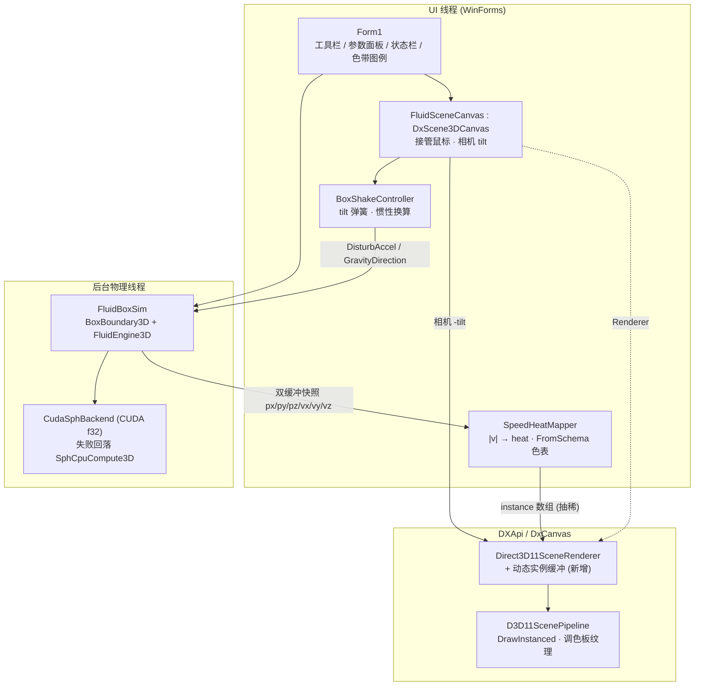

## 产品概述

在现有 WinForm 项目 `src\FluidBox` 中构建一个 3D SPH 液体盒子模拟器：窗体中央是一个可交互的 3D 盒子视口，盒内注入约 1000 万个 SPH 粒子（填充至盒子约 2/3 高度形成带自由液面的液体），由 `src\SPHEngine` 引擎在 CUDA GPU 上求解；粒子按运动速度大小映射为热图颜色；用户用鼠标拖拽盒子使其晃动（惯性 + 倾斜），液体因此获得动能并产生晃动后的流动变化。

## 核心功能

- **3D 液体盒子**：立方体容器（线框呈现），粒子以规则点阵填充底部 2/3 高度，上方留出自由液面空间。
- **1000 万粒子 SPH 求解**：基于 `FluidEngine3D` + `BoxBoundary3D`，通过 `CudaSphBackend.TryEnableGpu` 开启 CUDA 浮点内核；无 GPU 时自动回落 CPU 并行后端并在界面明示。
- **速度热图染色**：用 `Designer.FromSchema(ScalerPalette, 256)` 生成色表，按粒子速度 `|v|` 归一化后映射到该色表，速度越低越偏冷色、越高越偏暖色；界面同时显示色带图例与速度刻度。
- **鼠标拖拽晃动**：左键拖拽盒子 → 注入惯性加速度 + 让盒子视觉倾斜并同步旋转重力方向；右键拖拽 = 相机环绕，滚轮 = 缩放。松手后倾斜弹性回正、惯性按阻尼衰减、液体自然平复。
- **流畅观看体验**：物理在后台线程按自身节奏推进，渲染线程始终显示最新快照并按渲染点数预算自适应抽稀，状态栏实时显示后端、子步数、物理耗时、渲染帧率与点数。
- **参数面板**：粒子数、渲染点数预算、色表、点大小、重力/粘性/阻尼/晃动强度等可实时调节。

## 技术栈

- **语言/框架**：VB.NET，`net10.0-windows`，WinForms（`FluidBox.vbproj` 已配好 `UseWindowsForms=true`、`Platforms=AnyCPU;x64`，无需新增任何 `ProjectReference` 或 NuGet 包）。
- **物理求解**：`Moira.SPHEngine`（`CudaSphBackend`、`Kernels\moira_sph_f32.cu` NVRTC 运行时编译）+ `physics-netcore5` 的 `FluidEngine3D` / `SphState3D` / `BoxBoundary3D` / `UniformGrid3D`。
- **GPU 计算**：ILCuda + NVRTC CUDA float32 内核（`TryEnableGpu` / `FullSync`）。
- **3D 渲染**：`G:\Microsoft.VisualBasic.Drawing\src\DXApi`（D3D11 管线、HLSL、实例化点精灵）+ `DxCanvas`（`DxScene3DCanvas` WinForms 控件）。
- **配色**：`Microsoft.VisualBasic.Imaging.Drawing2D.Colors.Designer.FromSchema(ScalerPalette, n)`。

## 实现方案

### 总体策略

采用「**仿真 / 呈现 / 交互**」三层分离 + **物理异步、渲染同步**的双线程模型：

- `FluidBoxSim` 持有 `FluidEngine3D`，在后台线程以自己的节奏调用 `RunStep(dt)`；
- UI 线程以显示刷新率从最新快照并行重建实例数据（含抽稀与速度→heat 映射）并上传到 GPU；
- 晃动交互由 `FluidSceneCanvas`（继承 `DxScene3DCanvas`）接管鼠标后写入 `DisturbAccel` / `GravityDirection` / 相机倾角。

### 关键技术决策

**1. 渲染走「给现有 D3D11 后端加动态实例缓冲」，而不是自建后端**
已确认：`Native\D3D11.vb`（`Friend Module`）、`DxDevice`（`Friend Class`）、`DxGraphics.renderTarget`、`D3D11ScenePipeline`、`GpuSceneGeometry` 全是 `Friend`，且全仓 `InternalsVisibleTo` 命中 0 次 → FluidBox **无法**自建 D3D 管线。而 `Scene.LoadPointCloud` 每次会把 `Scene.Version+1`，导致 `D3D11ScenePipeline.GeometryOf` 的缓存签名失配，1000 万点每帧重建 320 MB 显存实例缓冲 + 约 1 GB 托管数组，不可接受。

因此采用**最小侵入的加法式扩展**：在 `Public NotInheritable Class Direct3D11SceneRenderer` 上新增三个公开成员（`EnsureInstanceCapacity` / `UploadInstances` / `ClearInstances`），内部持有 `D3D11_USAGE.DYNAMIC` 顶点缓冲，并在 `DrawPointCloud` 中「有外部实例就用外部实例，否则走原逻辑」。宿主 `Scene` 只放 12 条盒边 `LineSegment`（点数为 0），于是 `GpuSceneGeometry` 不会分配 320 MB 实例缓冲，只建 palette / quad / lines —— 正是想要的分工。
对比「新增一个完整 `ISceneRenderBackend`」：后者需要复刻 `RenderGpu` 全帧流程与离屏 blit，风险与代码量都大得多，故不采用。

**2. 世界尺度与参数整定（决定能否跑得动）**
`BoxBoundary3D` 域固定为 `[0, Size]`，无位移属性，故盒子无法整体平移；晃动通过「惯性力 + 重力方向旋转」在盒子局部坐标系内等效实现。
CFL 子步数 `n ≈ dt · c / (CflFactor · h)`，其中 `c = SoundSpeedFactor · ReferenceSpeed`、`h = 2·spacing`。放大盒子世界尺度可线性增大 `h` 而 `c` 只按 `√L` 增长，因此**子步数随盒子尺度下降**。取盒子边长 `L = 100`、液面高 `2L/3`：

- `spacing = (L²·2L/3 / 1e7)^(1/3) ≈ 0.405`，`h = 2·spacing ≈ 0.811`
- `ReferenceSpeed = √(2·9.81·2L/3) ≈ 36.2`，取 `SoundSpeedFactor = 3` → `c ≈ 108`
- `dt = 1/60` 时 `n ≈ 6~7`，由 `MaxSubSteps = 8` 兜底

即：**大尺度盒子 + 适度声速因子 + 限制 MaxSubSteps**，把每帧子步压到个位数。密度用解析值 `RestDensity = RestNearDensity = n/V_liquid` 并置 `AutoCalibrateDensity = False`，省掉一次 1000 万量级的标定扫描。

**3. 速度→颜色：GPU 调色板纹理与 `FromSchema` 同源**
`FromSchema(ScalerPalette.Jet, 256)` ≡ `GetColors("jet", 256)` ≡ `SceneColorPalette.GetTable("jet", 255)`（后者即 `Designer.GetColors(scheme, Levels, alpha)`、`Levels = 256`）。把 `canvas.ColorScheme` 设为同一 `ScalerPalette.Description`，GPU 端 256×1 调色板纹理就与 CPU 端 `FromSchema` 结果逐色一致；粒子只上传一个 `heat ∈ [0,1]`（实例缓冲偏移 24），**不生成 1000 万个 Color 对象**，同色表复用给界面色带图例。

**4. 抽稀与 heat 范围**

- 抽稀：`stride = max(1, ceil(n / budget))`，按粒子索引等间隔取样（初始点阵填充保证空间均匀）；预算 UI 可调 50 万~1000 万。
- heat 归一化：每帧随机抽样 65536 个粒子估计速度 min/max，再做跨帧指数平滑，避免色带闪烁；映射结果钳到 `[0,1]`。

**5. 晃动的物理与视觉**

- 惯性：`MouseMove` 的位移/时间差 → 屏幕速度 → 世界系加速度 → 累加进 `engine.DisturbAccel`（引擎每步按 `DisturbDamping` 自动衰减，松手即自然平复）。
- 倾斜：拖拽累计偏移 → `tiltX/tiltY`（带弹簧阻尼回正）；局部重力 `GravityDirection = Rᵀ·(0,0,-1)`。
- 视觉：把 `-tilt` 叠加到用户 orbit 相机角上（等价于整体旋转场景），这样 12 条盒边只需 `LoadConnections` 一次，规避 `Scene.LoadLineSegments` 每次减质心带来的累积漂移与几何重建。

**6. 并发模型**：单后台线程跑物理，双缓冲快照 + `Volatile`/锁交给 UI；UI 线程在 `Application.Idle` 里做「重建实例 → Upload → Invalidate」。

### 性能与资源（1000 万粒子量级）

| 项 | 量级 | 说明 |
| --- | --- | --- |
| 主机内存 | ~1.1–1.5 GB | `SphState3D` 18×`Single()`×1e7 ≈ 720 MB；实例暂存（pinned `Single()`，8 floats/点）按抽稀量另计 |
| 显存 | ~0.5–1 GB | CUDA 12 条 `DeviceBuffer(Of Single)` ≈ 480 MB；渲染实例缓冲 32 B × 渲染点数 |
| PCIe/子步 | ~360 MB | `FullSync = False` 后只在需要时 `SyncFields` |
| CPU 热点 | `UniformGrid3D.Build` | 单线程 O(n) 计数排序，每子步一次，是物理耗时主因；本期不改外部库，用 `MaxSubSteps` 与异步化规避 |
| 渲染 | 60 M 顶点/帧（1000 万点，quad 模式 6 顶点/实例） | 抽稀到 200 万点约 12 M 顶点，中端 GPU 可 60 fps；`PointShape=Square`、`MultisampleCount=1` |


## 实现注意事项（防止回归）

- 对 `G:\Microsoft.VisualBasic.Drawing` 的改动必须**纯新增 + 纯抽取重构**：`DrawPoints` 抽重载不改变原路径任何行为；新分支仅在新 API 被调用后激活；`DrawScene` 的点云判定只增加 `OrElse m_externalCount > 0` 条件。
- 不要用 `Engine.Entity` / `Particles` AoS 视图（每粒子 new Vector3），不要用 `FermenterTankSPH.FillLiquid`（`List(Of Single())` 逐粒子装箱，1000 万会 OOM）；直接写 `State.px/py/pz` 等 SoA 数组。
- `SphState3D.EnsureCapacity` 是二倍扩容，填充前一次性精确 `EnsureCapacity(n)`，避免瞬时内存翻倍。
- 运行时检查 `canvas.IsGpuPipelineActive` / `Renderer.LastError`：一旦回退到 `Direct2DSceneRenderer`（逐点 `FillRectangle`），必须限制渲染点数并提示用户，否则 1000 万点会卡死。
- 实例数据上传：预分配并 pin 一个 `Single()` 暂存缓冲，`Parallel.For` 写入后用一次 `Map(DISCARD)` + `Marshal.Copy` 提交，避免每点 8 次 `Marshal.WriteInt32`。
- 状态栏日志只记录后端名、子步数、耗时、点数，**不打印粒子数组内容**。

## 架构设计



## 目录结构

```
G:\Microsoft.VisualBasic.Drawing\src\DXApi\Scene3D\
├── Direct3D11SceneRenderer.vb     # [MODIFY] 新增 EnsureInstanceCapacity(n) / UploadInstances(data As Single(), count) / ClearInstances()；
│                                  #          内部持有 D3D11_USAGE.DYNAMIC 顶点缓冲（32 B × n），首次 Render 拿到 surface.Device 后惰性创建；
│                                  #          DrawPointCloud 增加「外部实例优先，否则原逻辑」分支；DrawScene 的点云判定追加 OrElse m_externalCount > 0。
│                                  #          纯新增，未调用新 API 时行为完全不变。
├── D3D11ScenePipeline.vb          # [MODIFY] 将 DrawPoints 抽取为 Friend Overloads Sub DrawPoints(scene, geometry, options, instances As IntPtr, instanceCount As Integer)，
│                                  #          原 DrawPoints 改为调用它并传入 geometry.EnsureInstances(...)。纯抽取重构，零行为变化。
└── GpuSceneGeometry.vb            # [MODIFY] 若 QuadBuffer 非 Friend，补一个 Friend ReadOnly Property QuadBuffer；其余不动。

g:\Moira\src\FluidBox\
├── Simulation\FluidBoxSim.vb      # [NEW] 仿真核心：BoxSpec（边长 L、液面 2L/3、目标粒子数）；按 spacing = (V/n)^(1/3) 生成规则点阵并直接写入
│                                  #       State.px/py/pz（EnsureCapacity 精确到位 + ClearDynamic + SetParticleCount）；参数整定（Gravity=9.81、
│                                  #       GravityDirection=(0,0,-1)、ParticleSpacing、WallPadding、ViscosityStrength、SoundSpeedFactor=3、
│                                  #       ReferenceSpeed、MaxVelocity=3·Ref、MaxAccel=30g、MaxSubSteps=8、CflFactor=0.35、
│                                  #       RestDensity=n/V、AutoCalibrateDensity=False）；CudaSphBackend.TryEnableGpu + FullSync=False；
│                                  #       Start/Stop/StepOnce、双缓冲快照 Publish/ReadSnapshot、LastSubSteps 与耗时统计。
├── Simulation\SpeedHeatMapper.vb  # [NEW] 速度→heat：抽样估计 |v| 范围并跨帧 EMA 平滑；BuildInstances(state, stride, budget) 用 Parallel.For
│                                  #       写入 pinned Single() 暂存（每点 8 floats：x,y,z,nx=1,ny,nz,heat,pad）；Palette(ScalerPalette) 调
│                                  #       Designer.FromSchema(scale, 256) 返回色表供渲染与界面色带共用。
├── Rendering\FluidSceneCanvas.vb  # [NEW] 继承 DxScene3DCanvas：构造时 LoadConnections 12 条盒边（只调一次）、PointShape=Square、
│                                  #       PointSize/PointAlpha/MultisampleCount=1、ColorScheme = 所选 ScalerPalette.Description、
│                                  #       EnableKeyboardShortcuts=False；重写 OnMouseDown/Move/Up 自行接管（左键=晃动、右键转发 Controller 做 orbit、
│                                  #       滚轮交基类缩放）；PushFrame(instances, count) 调 Renderer 的 UploadInstances 后 Invalidate。
├── Rendering\BoxShakeController.vb# [NEW] 晃动状态机：左键拖拽 → 屏幕位移/时间差 → 世界系加速度累加到 DisturbAccel；累计偏移 → tiltX/tiltY
│                                  #       （带弹簧阻尼回正）；输出 GravityDirection = Rᵀ·(0,0,-1) 与相机 tilt 增量；暴露 ShakeStrength 供面板调节。
├── Form1.vb                       # [MODIFY] 装配：创建 FluidBoxSim、FluidSceneCanvas、BoxShakeController；Application.Idle 渲染循环；
│                                  #       工具栏（开始/暂停/单步/重置、粒子数、渲染点数预算、色表、点大小）与状态栏（后端、子步、物理 ms、渲染 fps、渲染点数）。
└── Form1.Designer.vb              # [MODIFY] 布局：顶部工具栏 + 中央 3D 视口（Dock=Fill）+ 右下色带图例 + 底部状态栏 + 右侧可折叠参数面板。
```

## 关键代码结构

```
' 1) DXApi 新增的公开能力（纯新增，未调用时行为不变）
Public Sub EnsureInstanceCapacity(n As Integer)          ' 创建/重建 D3D11_USAGE.DYNAMIC 实例缓冲（32 B × n）
Public Sub UploadInstances(data As Single(), count As Integer)
'   data 布局（每点 8 个 Single，对应 PointInstanceStride = 32）：
'     [0]=X  [1]=Y  [2]=Z  [3]=NX(点尺寸因子，填 1.0)  [4]=NY  [5]=NZ  [6]=Heat∈[0,1]  [7]=Pad(0)
Public Sub ClearInstances()

' 2) 仿真核心（FluidBoxSim）——对外只暴露仿真语义，隐藏 SoA 细节
Public Class FluidBoxSim
    Public ReadOnly Property Engine As FluidEngine3D
    Public ReadOnly Property BackendName As String          ' "CUDA-F32" / "CPU-Parallel"
    Public ReadOnly Property LastStepMs As Double
    Public Sub New(boxSize As Single, fillFraction As Single, particleCount As Integer,
                   Optional palette As ScalerPalette = ScalerPalette.Jet)
    Public Sub Start() / Public Sub [Stop]() / Public Sub StepOnce()
    Public Function ReadSnapshot() As SphState3D            ' 双缓冲，UI 线程只读
    Public Sub ApplyShake(accel As Vector3, gravityDir As Vector3)
End Class

' 3) 晃动控制器输出
Public Structure ShakeState
    Public TiltX As Single      ' 弧度，绕 X 轴（由拖拽竖直分量驱动）
    Public TiltY As Single      ' 弧度，绕 Y 轴（由拖拽水平分量驱动）
    Public GravityDir As Vector3 ' 盒子局部系下的重力单位向量 = Rᵀ·(0,0,-1)
    Public Accel As Vector3      ' 本帧待注入 engine.DisturbAccel 的增量
End Structure
```

## 应用类型

Windows 桌面应用（`net10.0-windows` WinForms）。界面围绕「一个占据主区域的可晃动 3D 液体盒子」组织，其余控件均为深色玻璃质感面板，不遮挡视口。

## 设计风格

深色科技风格（Dark Tech / Glassmorphism 变体）：深蓝黑底 + 半透明浮层面板 + 高饱和青蓝点缀色；粒子本身以 Jet 热图（蓝→青→黄→红）呈现，与冷色 UI 形成强烈对比，让液体成为视觉主角。交互上强调「活着」的感觉：拖拽时盒子随动倾斜、惯性条实时跳变、色带刻度随速度上限平滑滚动。

## 页面规划（单页 Form1）

### 1. 顶部工具栏（高 44px，半透明浮层，悬浮于视口之上）

左侧为运行控制（开始/暂停、单步、重置）；中部为粒子数与渲染点数预算的下拉/滑块；右侧为色表下拉（Jet / viridis / turbo / inferno / magma 等）与点大小滑块。按钮为圆角胶囊形，青色描边，hover 时描边发光。

### 2. 中央 3D 视口（Dock=Fill，占据主要面积）

`FluidSceneCanvas`：深空渐变背景（#0B0F14 → #131A22 径向渐变），中央为浅青色半透明线框立方体（12 条边，1px，带轻微发光），盒内液体为密集点云。左键按住拖拽时盒子倾斜、液体随之涌动；右键拖拽环绕；滚轮缩放。视口左上角叠加一行半透明 HUD（后端、子步、物理耗时）。

### 3. 右下速度热图图例（宽 220px，浮层）

由 `Designer.FromSchema` 生成的 256 级色带（横向渐变条，圆角 4px，带 1px 内描边），下方标注 0 与当前速度上限（m/s）刻度，随 EMA 平滑更新；色带下方用小字标注当前色表名称。与粒子着色严格同源。

### 4. 右侧可折叠参数面板（宽 260px，抽屉式）

分组滑块：重力、粘性、碰撞阻尼、声速因子、晃动强度、惯性衰减。带数值实时回显；折叠后只留一条竖排图标条。面板为半透明毛玻璃，边缘 1px 分隔线。

### 5. 底部状态栏（高 28px）

左：后端（CUDA-F32 / CPU-Parallel）、子步数、物理 ms/步；中：渲染 fps、实际渲染点数；右：主机内存与显存占用估算。等宽字体、低对比度文字，仅在异常（如回退 CPU 或 Direct2D 画家）时以琥珀/红色高亮。

### 6. 加载遮罩（仅初始化时）

1000 万粒子填充与 CUDA 内核编译期间显示全屏半透明遮罩：居中进度条 + 阶段文字（"生成粒子点阵 / 编译 CUDA 内核 / 标定密度"），遮罩淡入淡出，避免初始化卡顿被误认为崩溃。

## Agent Extensions

### SubAgent

- **code-explorer**
- Purpose：在动手修改 `G:\Microsoft.VisualBasic.Drawing\src\DXApi` 前，逐字确认 `Direct3D11SceneRenderer.RenderGpu/DrawScene/DrawPointCloud`、`D3D11ScenePipeline.DrawPoints`、`GpuSceneGeometry.QuadBuffer`、`SceneMouseButton` 的确切签名与可访问性，避免改动破坏既有行为。
- Expected outcome：产出一份可直接落地的改动清单（新增成员位置、抽取重载的确切参数、需要提升为 `Friend` 的属性），确保对外部共享库只做加法式修改。