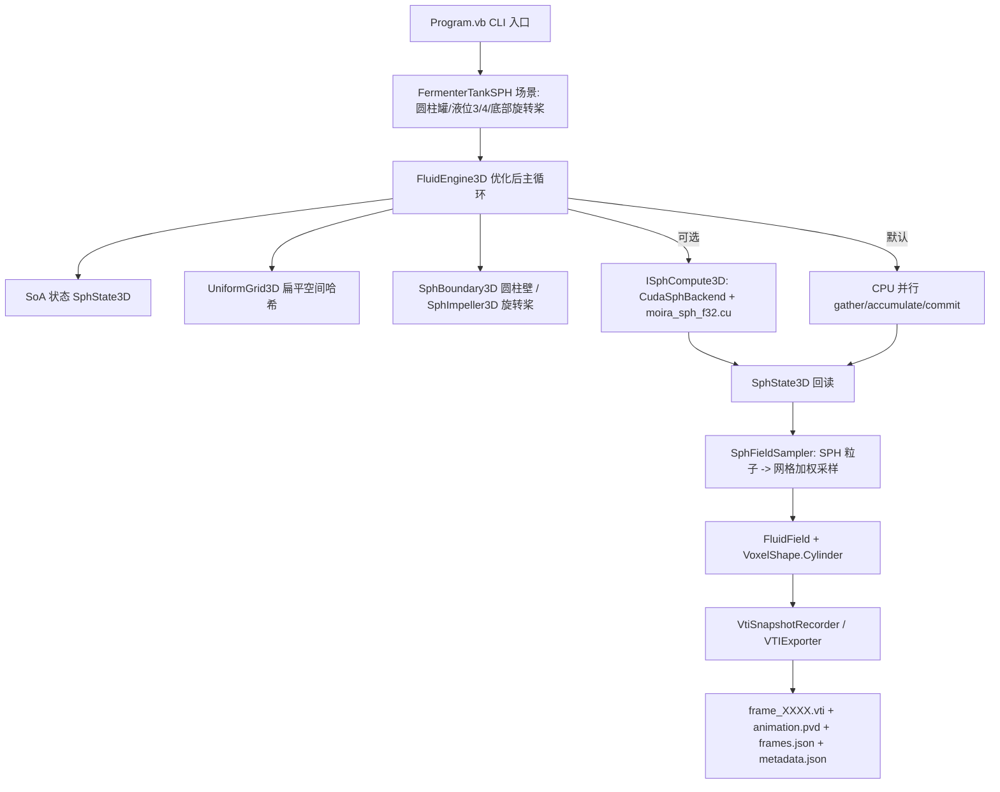

## 产品概述

在 `src\SPHEngine\SPHEngine.vbproj` 中构建面向**发酵罐发酵液**的 3D SPH CFD 计算引擎与可回放仿真示例。底层算法复用并优化 `G:\GCModeller\src\runtime\sciBASIC#\gr\physics\physics-netcore5.vbproj` 中已有的 3D SPH（双密度 Clavet 格式），修正其物理与稳定性缺陷并做性能优化；示例以圆柱形发酵罐为场景（底部旋转搅拌桨、发酵液液面位于罐高 3/4 处），通过 `src\CFDEngine\Snapshot` 模块导出 `.vti` 帧序列与配套元数据（`animation.pvd` / `frames.json` / `metadata.json`），供现有可视化软件做 CFD 动画回放。

## 核心功能

- **3D SPH 算法修正**：修正 3D 核函数归一化错误；压力力改为动量守恒的对称形式；粘性按密度归一化并限幅；补充自密度项；预测位置与时间步一致。
- **3D SPH 性能优化**：粒子数据改为 SoA（结构体数组）存储；邻居搜索改为扁平均匀网格（计数排序，O(n) 重建、无每粒子分配）；密度/压力/粘性三趟共用同一份邻居遍历；消除并行写读竞态（gather 只读 + 累加缓冲 + 统一 commit）。
- **稳定性增强**：CFL 自适应子步、速度钳制，避免液面抖动与爆炸。
- **场景能力扩展**：新增边界抽象（长方盒 / 圆柱罐壁）与运动边界（底部旋转搅拌桨，切向速度 ω×r，可选轴向泵送），支持自由液面。
- **发酵罐仿真示例**：圆柱形罐体、底部旋转搅拌桨、液位 3/4 罐高；粒子按液面以下规则点阵初始化。
- **结果导出**：把 SPH 粒子场采样到 CFDEngine 的 `FluidField` 网格（U/V/W、Pressure、Density，圆柱体素掩膜），用 `VtiSnapshotRecorder` 按间隔输出 `.vti` 帧与动画索引；`metadata.json` 记录网格、掩膜、dt、求解器信息。
- **CUDA GPU 加速（可选）**：为邻居搜索与核函数求和提供 CUDA 后端，注册失败自动回退 CPU；命令行 `--no-gpu` 可强制 CPU。
- **控制台入口**：`dotnet run --project src\SPHEngine` 直接运行，参数可调粒子数、网格、转速、步数、采样间隔、输出目录。

## 技术栈

- 语言/框架：VB.NET（.NET 10 / net10.0），SDK 风格 vbproj，与现有工程一致（`LangVersion 16.9`、`OptionStrict Off`、`OptionInfer On`）。
- 底层算法库：`physics-netcore5.vbproj`（自定义 `Vector3`/`Particle3D`/`FluidEngine3D`/`Grid3D`，双精度；本次内部计算改为 Single 以便 GPU 直通）。
- 网格与导出：`CFDEngine.vbproj`（`FluidField` + `TensorF` 单精度张量、`VoxelShape`、`Snapshot.VtiSnapshotRecorder`、`Snapshot.VTIExporter`、`Snapshot.JSON.SnapshotMetadata`）。
- GPU：`Microsoft.VisualBasic.Computing.ILCuda.Runtime`（`CudaEngine.TryCreate` / `KernelSources.RegisterSource` / `DeviceBuffer(Of Single)` / `kernel.Launch(LaunchPlanner.For1D(n,256), ...)`），内核为内联 `.cu` 源码经 NVRTC 编译，嵌入程序集。
- 并行：`System.Threading.Tasks.Parallel`（沿用现有 `par.For` 风格）。

## 实现方案

### 1. SPH 物理修正（根因，决定"效果好坏"）

经逐项核算（三维球体积分 `∫(h−r)^n 4πr²dr`）：

| 核 | 正确归一化 | 现状 | 结论 |
| --- | --- | --- | --- |
| Poly6 `(h²−r²)³` | `315/(64π h⁹)` | 同 | 正确 |
| SpikyPow3 `(h−r)³` | `15/(π h⁶)` | 同 | 正确 |
| d/dr SpikyPow3 | `45/(π h⁶)` | 同 | 正确 |
| SpikyPow2 `(h−r)²` | `15/(2π h⁵)` | `15/(π h⁵)` | **偏大 2×** |
| d/dr SpikyPow2 | `15/(π h⁵)` | `30/(π h⁵)` | **偏大 2×** |


其余非归一化层面的稳定性缺陷：

1. **压力力不对称**（`sharedPressure / neighbourDensity`）：动量不守恒 → 抖动/整体漂移。改为对称形式 `f_i = −Σ (p_i/ρ_i² + p_j/ρ_j²)·∇W_ij`，近压力项同构处理。
2. **粘性未归一化且无上限**：`Velocity += Σ(v_j−v_i)·W·k·dt` 缺 `/ρ_j` 且不受限 → 大 dt 时过冲。改为按密度归一化 + 单步速度增量钳制。
3. **缺自密度项**：密度循环 `If neighbour.Index = id Then Continue For` 排除自身，标准 SPH 应计入 `W(0)`。
4. **预测位置与时间步不一致**：硬编码 `predictionFactor = 1/120`，与 `DeltaTime=1/60` 无关；改为属性（默认等于 `DeltaTime`，保留可覆盖）。
5. **并行竞态**：`CalculateViscosity` 并行写 `Velocity` 同时读邻居 `Velocity`；压力趟写 `Velocity`。改为"gather 只读旧状态 → 写累加缓冲 → 统一 commit"，彻底无竞态，且该形态与 GPU kernel 一一对应。
6. **无 CFL 控制**：新增 `MaxSubSteps` / `MaxVelocity`，按 `maxSpeed·dt ≤ 0.4·粒子间距` 自动切分子步。

向后兼容：`FluidEngine3D` 的公共成员（`New(n, box, smoothingRadius)`、`Entity`、`Count`、`Reset`、`RunSimulationStep`、Gravity/DeltaTime/BoxSize/TargetDensity/PressureMultiplier/NearPressureMultiplier/ViscosityStrength/ParticleSize/SmoothingRadius/DisturbAccel/DisturbDamping/CollisionDamping）全部保留，既有调用方 `gr\FluidSim3D\MainForm.vb`、`WaterRenderer.vb`、`gr\physics\test\Form4.vb` 无需修改（行为只会更稳定）。

### 2. 性能优化

- **SoA 布局**：`Single()` 数组存 `posX/Y/Z, velX/Y/Z, prdX/Y/Z, density, nearDensity, accX/Y/Z`，消除每粒子对象与 `Vector3` 分配；`Entity` 属性按需把 SoA 同步回 `Particle3D()` 视图（渲染/调试路径，非热路径）。
- **扁平均匀网格**：替代 `Dictionary(Of (Integer,Integer,Integer), Particle3D())` + LINQ `GroupBy/ToDictionary`。采用计数排序：`cellCount → 前缀和 cellStart → cellEntries`，每步 O(n) 重建、零 GC；27 邻格遍历用 `(cx+dx, cy+dy, cz+dz)` 直接索引，不再使用 `Iterator`（原实现每粒子每趟分配枚举器）。
- **三趟合一**：一次网格构建 + 一次邻居遍历内同时累加密度、近密度；压力与粘性两趟复用同一网格与邻居范围（不再各自重复求距离三遍）。
- **并行分块**：`Parallel.For(0, n, ...)` 配合只读输入数组，无锁、无 false sharing（按粒子索引连续访问）。
- 复杂度：邻居搜索由 `O(n²)`（旧字典查询常数大）降为 `O(n·k)`，k≈27 格内邻居数（约 30~60），单步内存分配由"每步重建字典 + 每粒子迭代器"降为常数级缓冲复用。

### 3. 发酵罐场景与导出链路

- 罐体：圆柱（轴沿网格 Z，与 CFDEngine `k`=高度方向约定一致），半径 R、高 H，液面 `0.75·H`；`VoxelShape` 新增 `Cylinder` 工厂生成罐内体素掩膜（非活动体素在 VTI 中各场归零，形成清晰壁面）。
- 搅拌桨：底部 Rushton 式圆盘叶轮（半径 ≈0.35R，高度 ≈0.15H，含中心轴），以角速度 ω 旋转，对桨区附近粒子施加 `v = ω × r` 切向速度（可加轴向泵送分量），实现运动边界驱动。
- 粒子初始化：液面以下按规则点阵（间距 ≈ 平滑半径/2）填充，数量由 CLI 控制（默认 2~5 万）。
- **粒子→网格采样**（`SphFieldSampler`）：每个输出帧，用粒子构建一次体素网格分箱，对活动体素做 SPH 核加权 gather：`U/V/W` 为核加权速度均值，`Density` 输出归一化 `ρ/ρ₀`（液体≈1、空气→0，适合可视化阈值），`Pressure` 为核加权压力。写入复用的 `FluidField`（每帧 `Clear` 后重填，不重复分配）。
- 导出：`VtiSnapshotRecorder(outputDir, "frame", interval, "animation.pvd", estimatedFrames, SnapshotMetadata.FromField(field, viscosity, diffusion, dt, solver:="3D SPH (Clavet double-density, symmetric pressure)"))`，每 `interval` 步 `Capture(field, step, time)`，结束 `Finish()` → 输出 `frame_XXXX.vti` + `animation.pvd` + `frames.json` + `metadata.json`，ParaView / CDFDxCanvas 可直接加载回放。

### 4. CUDA GPU 后端（可选、自动回退）

- 借鉴 `CFDEngine\CudaTensorF.vb`：`KernelSources.RegisterSource("moira_sph_f32.cu", src)` 必须在 `CudaEngine.TryCreate` 之前；内核源码以 `EmbeddedResource` 嵌入。
- 内核：`moira_sph_density`（密度+近密度）、`moira_sph_force`（对称压力力+归一化粘性，写入加速度缓冲）、`moira_sph_integrate`（速度/位置积分 + 圆柱边界投影 + 桨区速度强制）。
- 数据策略：每帧上传 `pos/vel` 一次，网格（`cellStart/cellEntries`）在主机端计数排序后上传，密度/加速度缓冲常驻显存；仅快照帧回读 `pos/vel/density/pressure`。`TryEnableGpu()` 失败（无设备/NVRTC 失败）自动回落 CPU 路径，`--no-gpu` 强制 CPU。GPU 与 CPU 使用同一套 SoA 状态与同一核函数常数，保证两条路径结果可比。

## 架构设计



分层：`physics-netcore5` 只提供**纯 CPU、无 CUDA 依赖**的 SPH 内核与抽象（SoA/网格/边界/后端接口）；`SPHEngine` 提供场景、网格采样、CUDA 后端与 CLI 入口；`CFDEngine` 仅被用作网格数据结构与快照导出（不改动其求解器）。这样 SPH 与 StableFluids 两套求解器互不干扰，blast radius 可控。

## 目录结构

```
G:\GCModeller\src\runtime\sciBASIC#\gr\physics\            # 底层 3D SPH（优化，纯 CPU）
├── Particles\FluidKernels3D.vb        # [MODIFY] 修正 SpikyPow2 与其导数的 3D 归一化常数（15/(2πh⁵)、15/(πh⁵)）；保留全部现有方法名与签名；补充 Poly6/Spiky 常量注释与自密度项 W(0) 辅助
├── Particles\SphState3D.vb            # [NEW] SoA 粒子状态：posX/Y/Z、velX/Y/Z、prdX/Y/Z、density、nearDensity、accX/Y/Z（Single()）；负责与 Particle3D() 视图互同步、缓冲复用与容量扩容
├── Particles\UniformGrid3D.vb         # [NEW] 扁平均匀网格：计数排序构建（cellCount/cellStart/cellEntries）、域裁剪、27 邻格范围查询接口（无迭代器分配）
├── Particles\SphBoundary3D.vb         # [NEW] 边界抽象：MustInherit SphBoundary3D（Project 位置/速度 + Bounds）；BoxBoundary3D（等价旧长方盒行为，默认）、CylinderBoundary3D（圆柱罐壁 + 罐底 + 顶部自由液面）
├── Particles\SphImpeller3D.vb         # [NEW] 运动边界：Rushton 式圆盘叶轮（中心轴、半径、盘高、角速度、轴向泵送），对桨区粒子施加 ω×r 切向速度（带混合权重，避免硬覆盖导致发散）
├── Particles\ISphCompute3D.vb         # [NEW] 可插拔计算后端接口：CPU/GPU 共用 TryRunSubstep(state, grid, params, dt)；使 physics 项目不依赖 CUDA
└── Particles\FluidEngine3D.vb         # [MODIFY] 主循环重写：外力/预测 → 建网格 → 密度(含自项) → 对称压力力 → 归一化粘性(限幅) → commit → 积分/边界/桨驱动；新增 CFL 子步、速度钳制、PredictionFactor 属性、GravityDirection（发酵罐 Z 轴朝上）、Boundary/Impeller/Backend 属性、CalibrateTargetDensity()；公共 API 全部保留

g:\Moira\src\CFDEngine\
└── VoxelShape.vb                      # [MODIFY] 新增 Shared Function Cylinder(width, height, depth, radius, bottomZ, topZ)：沿 Z 轴圆柱体素模型（风格对齐既有 Capsule 工厂），供发酵罐掩膜使用

g:\Moira\src\SPHEngine\
├── SPHEngine.vbproj                   # [MODIFY] OutputType=Exe、StartupObject=SPHEngine.Program；新增 EmbeddedResource Kernels\moira_sph_f32.cu；新增 ProjectReference 到 ILCuda.vbproj（与 CFDEngine 同款）；GeneratePackageOnBuild 视情况置 False
├── Class1.vb                          # [DELETE] 空占位类
├── SphFieldSampler.vb                 # [NEW] SPH→网格采样：粒子分箱 + 核加权 gather，填 U/V/W、Pressure、归一化 Density 到复用的 FluidField
├── FermenterTankSPH.vb                # [NEW] 发酵罐场景：圆柱罐几何、3/4 液位粒子点阵初始化、底部旋转桨、时间步进与统计；提供 ToFluidField() 与 Run(steps, dt, interval, recorder)
├── CudaSphBackend.vb                  # [NEW] ISphCompute3D 的 CUDA 实现：内核注册（先 RegisterSource 再 TryCreate）、设备缓冲管理、每帧一次上传/快照帧回读、TryEnableGpu() 与自动 CPU 回退
├── Kernels\moira_sph_f32.cu           # [NEW] float32 CUDA 内核：moira_sph_density / moira_sph_force / moira_sph_integrate（网格布局与 CPU 一致）
└── Program.vb                         # [NEW] 控制台示例入口：解析 --particles/--grid/--nz/--fill/--rpm/--steps/--dt/--interval/--out/--no-gpu；进度输出；结束后打印 animation.pvd 等产物路径与 ParaView 使用提示
```

## 关键代码结构

```
' physics-netcore5：边界抽象（长方盒 / 圆柱罐壁 / 运动桨）
Public MustInherit Class SphBoundary3D
    Public MustOverride Sub Project(ByRef x As Single, ByRef y As Single, ByRef z As Single,
                                    ByRef vx As Single, ByRef vy As Single, ByRef vz As Single,
                                    damping As Single)
    Public MustOverride Function Bounds() As (minX!, minY!, minZ!, maxX!, maxY!, maxZ!)
End Class

' physics-netcore5：可插拔计算后端（CPU 默认实现 / SPHEngine 的 CUDA 实现）
Public Interface ISphCompute3D
    Function TryRunSubstep(state As SphState3D, grid As UniformGrid3D,
                           h As Single, dt As Single,
                           targetDensity As Single, pressureK As Single, nearPressureK As Single,
                           viscosity As Single, gravity As (x!, y!, z!)) As Boolean
End Interface

' SPHEngine：SPH 粒子场 → CFDEngine 网格场（供 VTI 导出）
Public Class SphFieldSampler
    Public Sub New(shape As VoxelShape, smoothingRadius As Single)
    Public Function Sample(state As SphState3D, field As FluidField,
                           Optional restDensity As Single = 1.0F) As FluidField
End Class
```

## 实施注意事项

- **向后兼容优先**：`FluidEngine3D` 只改内部实现与新增可选属性，不改/删任何现有公共成员签名；`Grid3D` 模块保持原样（新增 `UniformGrid3D` 而非替换），避免影响 `FluidSim3D` 演示与 `test\Form4.vb`。
- **核常数改动会改变密度尺度**：`TargetDensity` 默认 0.00034 与旧尺度耦合，需为优化后引擎提供 `CalibrateTargetDensity()`（对静止液体点阵求核和），发酵罐示例构造时自动调用一次并把结果写入 `metadata.json` 的 Simulation 段。
- **热路径零分配**：网格构建与三趟力计算复用预分配数组；`FluidField` 每帧 `Clear()` 后重填，不新建 `TensorF`（避免 GC 抖动）。
- **并行粒度**：`Parallel.For` 仅用于按粒子索引的只读 gather 与累加写各自槽位；commit 与积分单独串行/并行一趟，确保与 CPU 单线程结果一致（便于 CPU/GPU 对照）。
- **GPU 回退**：CUDA 注册/编译/内核获取任一失败即返回 False 并切回 CPU，异常信息落到 `LastError` 与控制台提示，不中断仿真；默认开启 GPU，可用 `--no-gpu` 复现 CPU 基准。
- **日志与输出体积**：仅每 N 步打印一行进度（步号/时间/最大速度/平均密度），不打印逐粒子数据；`.vti` 默认不压缩（兼容所有 ParaView 版本），帧数多时可选 `compress:=True`（`VTIExporter` 已支持）。
- **验证口径**：先小参数冒烟（`--particles 4000 --steps 20 --interval 5`）确认产物齐全（4 类文件、mask 仅在圆柱内非零、液位≈0.75H），再做中等规模；GPU 与 CPU 同参数跑 20 步比对平均密度/最大速度相对偏差。

## Agent Extensions

### SubAgent

- **code-explorer**
- 用途：在重写 `FluidEngine3D` 前后，全面检索 `FluidEngine3D` / `FluidKernels3D` / `Grid3D` / `Particle3D` 的全部引用点（含 `gr\FluidSim3D`、`gr\physics\test`、其它 GCModeller 工程），确认公共 API 改动不会造成既有调用方编译失败。
- 预期结果：得到受影响调用点清单与兼容性结论，确保新增属性/接口为可选扩展、既有签名零破坏。