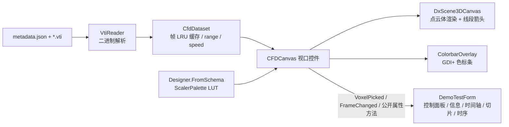

## 产品概述

基于 DirectX 的 WinForms 交互式 CFD 结果三维可视化视口控件 `CFDCanvas`，用 VB.NET 在 `src\CDFDxCanvas` 项目中实现。控件只负责 3D 体渲染视口（含色标条叠加），控制面板/信息面板/时间轴由宿主窗体通过控件公开的属性、方法与事件自行搭建，功能与视觉复刻 `src\app\cfd-player.html`。

## 核心功能

- 数据加载：解析 `metadata.json`（Grid/Mask/Frames）+ `.vti` 帧（mask/pressure/density/velocity），Frames 为空时自动扫描文件夹内 `*.vti` 按名排序补齐；speed 由 u/v/w 现算
- 体渲染热图：体素点云着色，标量场切换（pressure/density/speed），热图颜色必须由 `Designer.FromSchema(ScalerPalette, 256)` 生成，调色板可切换
- 颜色值域：自动（min/max）或手动范围；透明阈值 0~1 滑动过滤
- 速度矢量箭头：线段箭头近似，长度∝速度幅值（maxLen=spacing×1.7），颜色按速度热图，密度 2/3/4 档
- 横截面：X/Y/Z 轴 + 位置滑条，过滤截面远侧体素与箭头
- 拾取交互：点击体素高亮（线框盒），抛出事件供宿主显示 (i,j,k)、场值、(u,v,w)、|V| 及时间序列
- 色标条：视口右上角叠加层，渐变条 + 场名与 [min, max] 标题
- 相机：轨道控制（左键旋转/右键平移/滚轮缩放），加载后自动对准网格中心
- 测试窗体 `DemoTestForm`：内含字段/调色板选择、阈值与截面控制、时间轴播放（fps + 帧滑条）、体素信息、2D 切片热图与时间序列曲线（GDI+ 绘制），加载 `G:\fermenter\src\demo\cfd` 验证

## 技术栈

- VB.NET，WinForms，net10.0-windows（沿用 `CDFDxCanvas.vbproj` 现有配置与全部既有 ProjectReference，不新增依赖）
- 3D 渲染：`Microsoft.VisualBasic.Drawing.DirectX.WinForm.DxScene3DCanvas`（点云 + 线段渲染、轨道相机、HitTest）
- 热图：`Microsoft.VisualBasic.Imaging.Drawing2D.Colors.Designer.FromSchema(ScalerPalette, n:=256)`
- 2D（色标条叠加、切片热图、时间序列）：GDI+ 自绘，复刻 charts.js 的视觉表现

## 实现方案

### 架构



### 关键决策

1. **数据层独立成类**：`VtiReader` 按写出端 `VTIExporter.vb` 的格式逆解析——读 XML 头至 `AppendedData` 的 `_` 标记，按 DataArray 声明顺序顺读 `UInt32 长度头 + 数组`（mask UInt8、pressure/density Float32、velocity 3×Float32）；VTI 内部顺序为 x 最快（t = k·nx·ny + j·nx + i），加载时重排回引擎索引 i·ny·nz + j·nz + k，固体体素（mask=0）直接丢弃，只保留活跃体素
2. **着色走显式 Color 方案**：为绕开 DxCanvas 内部 ColorScheme 热图（与用户指定 API 冲突），每帧用 `Designer.FromSchema(palette, 256)` 生成 LUT，按归一化值把 HTML 颜色串写入 `PointCloudPoint.Color`；LUT 在调色板/值域变化时重算一次，逐帧刷新只做查表，O(活跃体素数) 无额外开销
3. **阈值与横截面用点过滤实现**（DxCanvas 无裁剪平面）：重建 `IEnumerable(Of PointCloudPoint)` 后调 `UpdatePointCloud`（不动相机）；46732 活跃体素的重传成本可接受；阈值滑条加 ~100ms 节流防抖
4. **箭头与高亮共用线段层**：`UpdateConnections` 上传箭头线段（方向 = 速度单位向量，长度 = speed/speedMax×maxLen，颜色 = 速度 LUT）与拾取高亮线框盒（12 段），零速体素不出线段
5. **帧缓存**：单帧约 3MB（124K 体素 × 6 个 Float32 数组），LRU 容量 12 帧（与网页版一致），播放时预取下一帧；range 全局缓存随加载渐进更新
6. **测试入口**：vbproj 增加 `EnableDemoTest` 条件属性——默认仍为 `Library`；`-p:EnableDemoTest=true` 时切 `WinExe` 并指向 DemoTestEntry 的 Main，交付不影响控件库消费方

### 目录结构

```
src/CDFDxCanvas/
├── CDFDxCanvas.vbproj                  # [MODIFY] 增加 EnableDemoTest 条件 OutputType/StartupObject
├── CFDCanvas.vb                        # [MODIFY] 视口控件主体：状态属性、帧刷新管线、拾取、事件
├── CFDCanvas.Designer.vb               # [MODIFY] 布局：DxScene3DCanvas + ColorbarOverlay
├── Data/
│   ├── VtiReader.vb                    # [NEW] .vti 二进制解析（对应 VTIExporter 写出格式）
│   └── CfdDataset.vb                   # [NEW] metadata.json 加载、帧扫描、LRU 缓存、speed/range/idxToIJK
├── Rendering/
│   ├── CfdField.vb                     # [NEW] CfdField/Axis/CfdRange 视图模型枚举与结构
│   └── VoxelSceneBuilder.vb            # [NEW] 帧+视图状态 → 点云/线段（LUT 查表、阈值/截面过滤、箭头、高亮盒）
├── ColorbarOverlay.vb                  # [NEW] GDI+ 色标条叠加控件
└── DemoTestForm.vb                     # [NEW] 临时测试窗体：面板布局 + GDI+ 时序/切片图 + 播放循环
```

### CFDCanvas 公开 API（关键契约）

```
Sub LoadDataset(folder As String)
Property Field As CfdField                ' Pressure | Density | Speed
Property Palette As ScalerPalette         ' 默认 Jet
Property AutoRange As Boolean  : Property RangeMin/RangeMax As Double
Property Threshold As Double              ' 0..1
Property ShowArrows As Boolean : Property ArrowDensity As Integer    ' 2/3/4
Property SectionEnabled As Boolean : Property SectionAxis As Axis : Property SectionPosition As Integer
Property FrameIndex As Integer            ' set 时刷新视口
ReadOnly Property Dataset As CfdDataset
Event FrameChanged(frameIndex As Integer)
Event VoxelPicked(e As VoxelPickEventArgs)   ' 含 idx/i/j/k、场值、u/v/w、|V|
Function RenderSliceBitmap(axis As Axis, pos As Integer, width As Integer, height As Integer) As Bitmap
Function GetVoxelSeries(idx As Integer, field As CfdField) As (times As Double(), values As Double())
```

### 实施注意

- 逐帧刷新统一走 `UpdatePointCloud/UpdateConnections`（不动相机），仅首次加载用 `LoadPointCloud`（自动 FitView 对准网格中心）
- 拾取用 `HitTest` 映射回体素索引；拖拽超过 4px 视为旋转不触发拾取（与网页版一致）
- 点云集合重建时复用数组避免每帧大量分配；大网格逐帧更新是热路径，避免 LINQ
- DemoTestForm 的 2D 切片/时序图为测试辅助 UI，实现复用 `RenderSliceBitmap` 与 `GetVoxelSeries`，验证公开 API 的完整性
- 不改动 CFDEngine 与其他项目；全部新文件限定在 CDFDxCanvas 项目内

## 设计风格

复刻 cfd-player.html 的清爽数据可视化风格：浅灰蓝背景视口 + 白色卡片式叠加层。CFDCanvas 视口控件本体仅包含两块：全幅 3D 渲染区（DxScene3DCanvas，背景 #F4F6FA，地面网格可关）与右上角半透明白色圆角色标条叠加层（LUT 渐变 22×220px + 11px 场名/[min,max] 标题，带 1px #E2E8F0 边框与阴影）。DemoTestForm 按"左控制面板 288px / 中视口 / 右信息面板 320px / 底部 60px 时间轴"四区布局，卡片内控件统一圆角、细边框、#2563EB 主色按钮（播放键为圆形），滑条用系统 TrackBar，整观感与网页版对齐。

## Agent Extensions

### SubAgent

- **code-explorer**
- Purpose：实现前精确核实 DxCanvas 细节——`SceneHitTest` 返回结构（能否取回点索引）、`UpdatePointCloud/UpdateConnections` 精确签名、`PointCloudPoint.SizeScale/Color` 生效条件
- Expected outcome：拿到精确签名证据，避免按猜测编码导致返工