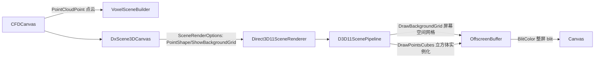

## 需求概述

针对 CFD 仿真结果 3D 可视化画布（src/CDFDxCanvas）进行两项渲染优化，并完成编译与实测验证：

## 产品概述

- **优化 1（体素立方体化）**：当前体素由 D3D11 管线将点云实例扩展为屏幕空间方形面片（“方片”）绘制，且关闭深度测试，导致旋转到某些视角时模型呈现片状/不可见。需将体素改为真正的三维立方体（世界空间、带法向着色、带深度遮挡），任意旋转角度下模型均保持可见、立体。
- **优化 2（2D 网格背景）**：在画布上叠加白色网格背景。网格为 2D 屏幕空间元素，直接绘制在画布上，不属于 3D 场景，不随相机旋转；3D 模型应自然遮挡网格（网格位于最底层）。
- **优化 3（编译验证）**：完成后用 `dotnet` 编译 `win32_desktop.sln`，运行 `win32_desktop\CFD_win32.vbproj` 输出的 exe，通过 RibbonMenu.vb:17 的 `CommonRuntime.ShowSingleDocument(Of PageCFDPlayer)()` 打开画布页，用 `G:\fermenter\src\demo\cfd` 发酵罐数据（经 PanelPlayerLeft.vb:10-16 的 btnLoad 加载）做可视化验证：多角度旋转确认体素立方体不消失，确认网格背景固定不旋转。

## 核心功能

- 体素点云按数据集 spacing 渲染为相互衔接的 3D 立方体，保留热图嵌入色与明暗着色
- 立方体渲染开启深度测试，前后遮挡关系正确
- 屏幕空间 2D 白色网格背景，固定于画布底层
- 悬停/拾取（HitTest）在新渲染模式下保持可用
- 编译产出可运行的 win32 桌面程序并用 demo 数据验证

## 技术栈

- VB.NET / .NET 10 (net10.0-windows) + WinForms + 自研 Direct3D 11 渲染管线（`Microsoft.VisualBasic.Drawing` 共享库，源码项目引用）
- 渲染链路：`CFDCanvas`（VoxelSceneBuilder 生成点云）→ `DxScene3DCanvas` → `Direct3D11SceneRenderer` → `D3D11ScenePipeline`（运行时编译 Scene3DShaders.hlsl）

## 实现方案

### 1. 体素立方体化（核心改动，位于共享库 g:/Microsoft.VisualBasic.Drawing/src/DXApi/Scene3D）

现有 `VS_Point` 把每个点实例扩展为屏幕空间 quad（`clip.xy += quad.corner * size * viewportScale`），且 `DrawPoints` 关闭深度测试。新增一条**世界空间立方体实例化**绘制路径，点云实例数据（`PointInstance`，位置+嵌入色）完全复用，无需每帧重建大几何：

- **Scene3DShaders.hlsl / Scene3DShaders.vb**：新增 `VS_PointCube` 顶点着色器入口：逐顶点流输入立方体角点（偏移+法线），逐实例流输入 `PointInstance`；输出 `position = mul(worldViewProj, instance.position + corner.offset * cubeEdge)`，复用现有 `PS_Surface`（SurfaceOutput：normal+color）做 lambert 着色，颜色取实例嵌入色。`SceneConstants` 新增一个 `float4 pointParams`（立方体三轴世界边长 + 模式标志），hlsl 与 Scene3DShaders.vb 的常量结构双侧同步（16 字节对齐）。
- **GpuSceneGeometry.vb**：新增 `BuildCube()`：36 顶点（12 三角形）的角点缓冲 `CubeCorner{float3 offset; float3 normal}`（24 字节，stride 与新输入布局 `CubeElements` 对应），仅创建一次、随几何缓存复用。
- **D3D11ScenePipeline.vb**：新增 `DrawPointsCubes(...)`：`TRIANGLELIST` 实例化绘制（cubeBuffer + instanceBuffer），`m_depthWrite` 开启深度写入/测试，`m_rasterSolid`，复用 `m_blendAlpha`；在 `DrawScene` 的 PointCloud 分支中按选项分流。
- **SceneRenderOptions.vb**：新增 `PointShape`（Square/Cube 枚举，默认 Square 保持向后兼容）与 `CubeFill`（立方体边长占 spacing 比例），纳入 `Clone()`；立方体尺寸属逐帧常量，不进入 `GeometrySignature`（避免几何重建）。
- **DxScene3DCanvas.vb**：暴露 `PointShape`/`CubeFill` 属性转发到 `m_options` 并 `Invalidate`。
- **Direct2DSceneRenderer.vb（回退路径）**：保持现有方形点绘制不变（GPU 不可用时的降级行为，可接受）。

### 2. 2D 屏幕空间网格背景

3D 帧先渲染进 MSAA 离屏缓冲再整屏 blit 覆盖画布，因此网格必须画进**离屏缓冲、Clear 之后、3D 几何之前**：

- **SceneRenderOptions.vb**：新增 `ShowBackgroundGrid`（默认 False）、`BackgroundGridColor`（默认 White）、`BackgroundGridCellSize`（默认 32 像素），纳入 `Clone()`。
- **D3D11ScenePipeline.vb**：新增 `DrawBackgroundGrid(size, options)`：按视口尺寸与格距生成裁剪空间（clip space）线段列表（直线横竖贯穿全屏），用 `m_positionLayout` + `m_unlitPixel`、深度关闭绘制；线段顶点用持久缓冲 + `UpdateSubresource`（仅视口/格距变化时重建，每帧 CPU 开销为几十条线段，可忽略）。
- **Direct3D11SceneRenderer.vb**：`RenderGpu` 中 `Clear` 之后、`SetScene` 之前调用；Direct2DSceneRenderer 同步实现（画布 Clear 后先画网格再画几何），保证回退路径一致。
- **DxScene3DCanvas.vb**：暴露 `ShowBackgroundGrid`/`BackgroundGridColor`/`BackgroundGridCellSize` 属性。

### 3. 应用侧接线（g:/Moira/src/CDFDxCanvas/CFDCanvas.vb）

- 构造函数启用：`PointShape = Cube`、`ShowBackgroundGrid = True`、`BackgroundGridColor = White`、格距约 32px；`CubeFill` 默认约 0.95 使相邻立方体衔接。
- 立方体边长 = 数据集 `Spacing`（三轴各自取值）× `CubeFill`，在 `RebuildScene()`/常量更新处随场景传入。
- `AdaptPointSize()`（像素点大小自适应）仅在 Square 模式生效；Cube 模式下改用 `TryProjectPoint` 实测体素投影间距计算 `HitRadius()`，保证悬停/拾取半径随缩放仍然合理。

## 架构

## 性能与风险

- 立方体实例化：实例数据不变（N 个点），顶点从 6/点 增至 36/点，10 万体素 ≈ 360 万顶点/帧，GPU 负载可接受；几何缓存按 scene revision 复用，无逐帧重建。
- 深度测试开启后遮挡关系由硬件保证，替代原先“无深度、按缓冲序覆盖”的错误视觉。
- 网格背景逐帧仅几十条线段的顶点上传，开销可忽略。
- 向后兼容：`PointShape` 默认 Square，`ShowBackgroundGrid` 默认 False，其他消费方（如 connectome 查看器）行为不变。
- 爆炸半径控制：仅触碰 Scene3D 渲染子系统的 4 个文件 + CFDCanvas，不改 VoxelSceneBuilder 数据构建与拾取映射逻辑。