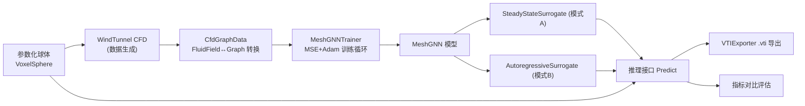

## 用户需求

在 g:/Moira 工作区的 `src\MeshGraph\MeshGraph.vbproj` 项目中，基于图神经网络（GNN）构建一个 CFD 仿真代理模型引擎，用于替代慢速的 Stable Fluids 求解器，为自动优化框架提供快速 CFD 评估能力。

## 核心需求点

1. **两种 GNN 代理模式均需构建**（用户已确认）：

- 模式 A：直接预测稳态流场（输入几何+来流条件，一次前向输出稳态速度场）
- 模式 B：自回归单步预测（学习单步时间演化，迭代 rollout 获得流场）

2. **训练数据**：多组参数化球体（不同半径、离地间隙、来流速度）由 `src\CFDEngine\WindTunnel.vb` 风洞仿真生成（用户已确认）
3. **风洞测试场景**：三维场景中地面上放置一个球体模型进行风洞测试
4. **可视化**：复用 `src\CFDEngine\Snapshot` 代码（VTIExporter）将 GNN 计算结果导出为 .vti 快照，可在 ParaView 中与 CFD 结果对比查看
5. **测试入口**：测试代码写在 `src\CFDEngine\test\GNNWindTunnel.vb`，并接入 `Program.vb` 命令行分支 `--gnn-windtunnel`（用户已确认）
6. **复用组件**：sciBASIC# 的 GNN 库（GCNConvLayer/Graph/AdamOptimizer）、TensorFlow 库（Tensor/TensorF）、ILCudaTensor/ILCuda（可选 GPU 加速）

## 预期效果

- 命令 `--gnn-windtunnel` 一键完成：生成多球体训练数据 → 训练两种 GNN 模型 → 地面球体风洞推理 → 与 CFD 结果误差对比（PASS/FAIL）→ 导出 CFD 与 GNN 的 .vti 文件供可视化
- 对外提供可编程调用的推理接口（输入体素几何+来流参数 → 输出 FluidField 流场与湍流指标）

## 技术栈

- 语言/框架：VB.NET，net10.0（MeshGraph 类库）+ net10.0-windows（test WinExe）
- GNN：sciBASIC# GNN 库（`GCNConvLayer`、`Graph`、`Edge`、`AdamOptimizer`、`GNNModel` 基类）
- 张量计算：sciBASIC# TensorFlow 库（`Tensor` Double 栈、`nn` 损失/激活）；CFD 侧数据为 `TensorF`
- GPU（可选）：`CudaTensor.Register()` 尝试注册，失败自动回退 SIMD CPU（注意 TensorF 无 CUDA 后端，仅 Tensor 计算链可加速）

## 实现方案

1. **图构建**：每个流体体素作为一个节点，6 邻域（±x/±y/±z）建无向边。节点特征：固体掩膜、归一化相对位置、来流速度 U∞（模式 A）；或当前 u/v/w/压力/掩膜/位置（模式 B）。标签：稳态 u/v/w（A）或下一时刻 u/v/w（B）。**关键约束：必须使用基于边表的 `Forward(input, graph)` 稀疏消息传递，严禁 `GetNormalizedAdjacencyMatrix()` 稠密矩阵**（N² 内存在 N≈10k 时约 800MB 不可行）。训练域网格控制在 24×16×24 量级（约 7k 节点、4 万边），保证单机可训练。
2. **模型**：实现空占位的 `MeshGNN` 类为节点级回归模型（继承 `GNNModel`）：`GCNConvLayer×2~3（ReLU）→ LinearLayer → 无激活输出 [N,3]`。模式 A/B 各一个封装：`SteadyStateSurrogate`（模式 A，输入几何+来流直接出稳态场）与 `AutoregressiveSurrogate`（模式 B，以初始均匀来流为起点 rollout，物理约束：固体体素速度强制清零）。二者共用 `MeshGNN` 骨干与统一推理接口 `Predict(shape, freestream) As FluidField`，供优化框架程序化调用。
3. **训练**：GNN 库 `Trainer` 仅支持交叉熵分类，需手写 MSE 训练循环：`LossFunctions.Compute/Gradient`（MSE）→ 逐层 `Backward` 反传 → `AdamOptimizer.Step()`。含 train/val 划分、epoch 日志、参数 JSON 持久化与重载。
4. **球体几何**：在 MeshGraph 项目新增体素球生成工具（含地面域组装：球体按离地间隙落位于 FullBox 域内），不修改 CFDEngine 主库源码（降低影响面）。
5. **数据集**：参数扫描（半径×离地间隙×来流速度 组合，约 8~12 组），每组运行 WindTunnel 至稳态采集：最终场（模式 A 标签）与逐步轨迹采样（模式 B 标签），保存到内存/临时目录。
6. **可视化与对比**：GNN 预测结果组装回 `FluidField`（借 `TensorF.Wrap`/`CopyFrom`），用 `VTIExporter.Export` 导出 .vti + pvd；用 `WindTunnel` 同款指标（最大/平均速度、enstrophy、尾流亏损）做误差评估与 PASS/FAIL 断言。

## 性能与可靠性

- 训练瓶颈在 GCN 消息传递（O(N+E)×层数×epoch），域尺寸与 epoch 提供命令行参数可调；推理一次前向 O(N+E)，相比 CFD 数百步迭代有数量级加速
- 特征归一化（速度除以 U∞、坐标除以域尺寸）保证不同来流参数可泛化；自回归 rollout 误差累积通过限制 rollout 步数与固体掩膜硬约束缓解
- GPU 注册失败静默回退 CPU，不影响功能；Tensor/缓存对象及时 Dispose 遵循 WindTunnel 现有的预分配模式

## 架构



## 目录结构

```
g:/Moira/src/MeshGraph/                    # [MODIFY] GNN 代理模型引擎库
├── MeshGraph.vbproj                       # [无需修改] 已引用全部所需项目
├── VoxelSphere.vb                         # [NEW] 体素球几何工厂：CreateSphere(radius)、
│                                          #       BuildGroundDomain(...)（球+离地间隙+地面域组装）
├── CfdGraphData.vb                        # [NEW] FluidField/VoxelShape ↔ Graph 转换：
│                                          #       BuildGraph（6邻域边、节点特征）、
│                                          #       提取标签（稳态场/下一时刻场）、归一化与反归一化、
│                                          #       Graph→FluidField 还原
├── MeshGNN.vb                             # [MODIFY] 节点级回归 GNN 模型（继承 GNNModel）：
│                                          #       GCN×2~3 + Linear 解码 [N,3]，
│                                          #       Forward/Backward/GetParameters/GetGradients 实现
├── Surrogates.vb                          # [NEW] 两种代理封装：
│                                          #       SteadyStateSurrogate（模式A，几何→稳态场）、
│                                          #       AutoregressiveSurrogate（模式B，rollout），
│                                          #       统一 Predict(shape, freestream) As FluidField 接口
├── MeshGNNTrainer.vb                      # [NEW] 手写 MSE 训练循环（AdamOptimizer、
│                                          #       train/val 划分、逐层反传、epoch 日志）、
│                                          #       参数 JSON 保存/加载、CudaTensor.Register() 尝试注册回退
└── GnnDataset.vb                          # [NEW] 多球体参数扫描数据集生成器
│                                          #       （半径×离地间隙×来流速度 → WindTunnel 仿真采集）

g:/Moira/src/CFDEngine/test/               # [MODIFY] 测试项目
├── GNNWindTunnel.vb                       # [MODIFY] 测试模块（仿 WindTunnelTest 风格）：
│                                          #   1. 生成多球体训练数据 2. 训练模式A/模型B
│                                          #   3. 地面球体风洞 GNN 推理 4. 与 CFD 误差对比 PASS/FAIL
│                                          #   5. VTIExporter 导出 CFD/GNN 的 .vti+pvd
└── Program.vb                             # [MODIFY] 添加 --gnn-windtunnel 命令行分支
│                                          #   （--radius/--clearance/--freestream/--size/--epochs）
```

## 关键接口

```
' 统一推理契约（供自动优化框架调用）
Public Interface ICfdSurrogate
    Function Predict(shape As VoxelShape, freestream As Double) As FluidField
    Sub Save(filePath As String)
    Shared Function Load(filePath As String) As ICfdSurrogate
End Interface

' 图数据转换核心签名
Public Class CfdGraphData
    Shared Function BuildGraph(shape As VoxelShape, freestream As Double) As Graph
    Shared Function BuildGraphState(field As FluidField, freestream As Double) As Graph  ' 模式B含当前场特征
    Shared Function ExtractLabels(field As FluidField) As Tensor   ' [N,3] u/v/w
    Shared Function ToFluidField(output As Tensor, shape As VoxelShape) As FluidField
End Class
```

## Agent Extensions

### SubAgent

- **code-explorer**
- Purpose：实现前核实 GNN 库各层（GCNConvLayer/LinearLayer/ActivationLayer）Forward/Backward 的精确签名、梯度流约定、LossFunctions MSE 梯度形状与 AdamOptimizer 用法，避免训练循环写错
- Expected outcome：产出准确的层 API 签名清单，指导 MeshGNN 与 MeshGNNTrainer 的正确实现