## 需求概述

构建一套“三维模型文件 → 体素化 → 风洞试验场景 → CFD 风洞仿真 → VTI 结果导出”的完整流程。

## 核心功能

### 1. ZMesh 风洞初始化工具（src/ZMesh/ZMesh.vbproj，仅构建模型加载与场景构建）

- 调用 Landscape 的 `ModelLoader.LoadModel` 统一加载任意支持的 3D 模型文件（STL/GLTF/GLB/OBJ/DAE/3DS/3MF）
- 通过 Landscape 的 `Voxelizer.Voxelize` / `SDFVoxelizer.Voxelize` 将 `SceneModel` 体素化，API 提供参数选择两种体素化器实现，默认标准 Voxelizer
- 将 Landscape 的 `Voxelization.VoxelModel`（True=固体）转换为 CFDEngine 的 `VoxelModel`/`VoxelShape`（True=流体、固体为障碍），并补齐元数据（维度、固体体素数、固体包围盒等）
- 构建风洞试验三维场景：按 domainScale 放大计算空间、模型按离地高度定位（复用 `VoxelModelLoader.BuildDomain`），封装为可对外提供的“风洞场景”对象
- 提供 API 供外部调用者直接创建基于 `WindTunnel` 的风洞模拟实例

### 2. 风洞测试流程（src/CFDEngine/test）

- test.vbproj 已引用 ZMesh 项目，新增 `--zmesh-windtunnel` 命令行分支
- 默认加载 `src/app/airplane1.3mf` 作为测试模型，经 ZMesh 工具加载 + 体素化 + 场景构建后创建风洞
- 初始化 +X 来流，运行若干时间步，打印湍流指标（最大/平均速度、enstrophy、尾流亏损）
- 通过 `Moira.CFDEngine.Snapshot` 的 VTIExporter 逐帧导出 .vti 结果文件（含 animation.pvd），供 ParaView 等可视化

## 验收要求

- `dotnet run -- --zmesh-windtunnel` 开箱即跑，全流程无异常、指标无 NaN，输出目录生成 .vti 帧文件

## 技术栈

- 语言：VB.NET（.NET 10），与现有项目一致
- 依赖：Landscape（`Microsoft.VisualBasic.Imaging.Landscape`，模型加载 + 体素化）、CFDEngine（`Moira.CFDEngine`，VoxelShape/WindTunnel/Snapshot），ZMesh.vbproj 已引用两者，无需改动依赖
- 无 UI；纯类库 + 控制台测试

## 实现方案

### 1. ZMesh 场景构建器（新增，替换 Class1.vb）

新建 `Moira.ZMesh` 命名空间下的 `WindTunnelSceneBuilder`（Module 扩展风格，与 Landscape 的 `ModelLoader` Module 模式一致）：

```mermaid
graph LR
    A[3MF/STL/OBJ/... 模型文件] -->|"ModelLoader.LoadModel"| B[SceneModel]
    B -->|"Voxelizer / SDFVoxelizer.Voxelize"| C[Landscape VoxelModel 真体素网格]
    C -->|"语义反转转换 True固体→False障碍"| D[CFDEngine VoxelModel + VoxelShape]
    D -->|"VoxelModelLoader.BuildDomain 放大+定位"| E[风洞场景 WindTunnelScene]
    E -->|"InitializeFlow + Run"| F[WindTunnel 仿真]
    F -->|VTIExporter| G[.vti 帧文件]
```



- **类型消歧（关键）**：`VoxelModel` 在 Landscape（`...Voxelization.VoxelModel`，True=固体）与 CFDEngine（根命名空间，True=流体）同名且语义相反，代码中使用 `Imports LxVoxel = Microsoft.VisualBasic.Imaging.Landscape.Voxelization.VoxelModel` 别名消歧
- **转换逻辑**：遍历 Landscape 体素布尔数组，固体(True)映射为整数 1，调用现成的 `VoxelModelLoader.FromVoxelArray(width, height, depth, data, solidValue:=1)` 完成反转映射为 `VoxelShape`；同时统计固体体素数与包围盒填入 CFDEngine `VoxelModel` 元数据（复用 `VoxelModelLoader` 已有约定，避免重复实现）
- **体素化器选择**：枚举参数（Standard / SDF），Standard 走 `Voxelizer.Voxelize(sceneModel, resolution)`，SDF 走 `SDFVoxelizer.Voxelize(sceneModel, resolution, subSamples)`；默认 Standard
- **风洞场景封装**：`WindTunnelScene` 类持有源文件路径、体素分辨率、CFDEngine `VoxelModel` 及放大定位后的域 `VoxelShape`，提供 `CreateTunnel(freestream, viscosity, groundNoSlip)` 直接返回 `WindTunnel` 实例（内部走 `WindTunnel.New(shape, ...)`，绕过 JSON 路径重载）

### 2. 测试流程（test 项目，仿照现有 `--windtunnel` 分支模式）

- test.vbproj 增加 `<None Include="..\..\app\airplane1.3mf" CopyToOutputDirectory="PreserveNewest" />`
- 新增 `ZMeshWindTunnelTest.vb`，PASS/FAIL 控制台断言风格与 `WindTunnelTest.vb` 一致：加载 3mf → 体素化 → 断言维度/固体数>0 → BuildDomain → 断言域维度与最低固体位置 → `InitializeFlow` → `Run` 步进（每 N 步经 `VTIExporter.Export(field, path, step, time)` 落盘 vti）→ 湍流指标断言（无 NaN、enstrophy>0、尾流亏损>0）
- `Program.vb` 增加分支派发与参数解析（`--model`、`--resolution`、`--scale`、`--clearance`、`--steps`、`--freestream`、`--voxelizer`），未传模型时默认用输出目录中的 airplane1.3mf

### 性能与可靠性

- 体素化是主要耗时瓶颈（BVH/SDF 三角形遍历），resolution 可控（默认建议 32~64，避免 domainScale 放大后计算域爆炸）；体素转换 O(W×H×D) 一次线性遍历，无额外开销
- VTI 导出复用 CFDEngine 现有二进制格式（64³ 单帧约 5.5MB），逐帧落盘不驻留内存
- 仅新增文件 + 最小化修改 test.vbproj/Program.vb，不触碰 CFDEngine/Landscape 任何现有逻辑，零回归风险

## 目录结构

```
g:/Moira/
├── src/
│   ├── ZMesh/
│   │   ├── WindTunnelScene.vb        # [NEW] 风洞场景封装：持有 CFDEngine VoxelModel 与放大后的域 VoxelShape，提供 CreateTunnel
│   │   ├── WindTunnelSceneBuilder.vb # [NEW] 场景构建器：ModelLoader 加载 + 体素化（Standard/SDF 可选）+ 语义反转转换为 CFDEngine VoxelModel + BuildDomain
│   │   └── Class1.vb                 # [MODIFY] 删除空占位类
│   ├── CFDEngine/
│   │   └── test/
│   │       ├── test.vbproj           # [MODIFY] 增加 airplane1.3mf 的 CopyToOutputDirectory
│   │       ├── ZMeshWindTunnelTest.vb# [NEW] 基于 ZMesh 的风洞测试模块（加载→体素化→建场景→仿真→VTI导出→断言）
│   │       └── Program.vb            # [MODIFY] 增加 --zmesh-windtunnel 分支派发与参数解析
│   └── app/
│       └── airplane1.3mf             # [EXISTING] 默认测试模型（3MF，与现有 airplane1 JSON 同源）
```

## 关键接口

```
' WindTunnelSceneBuilder.vb（示意，最终签名以实现为准）
Public Enum VoxelizerKind
    Standard   ' Voxelizer.Voxelize（默认，快）
    Sdf        ' SDFVoxelizer.Voxelize（亚采样，边界质量更好）
End Enum

Public Module WindTunnelSceneBuilder
    ''' 加载模型文件并体素化，转换为 CFDEngine VoxelModel（True=流体）
    Public Function FromModelFile(filePath As String,
                                  Optional resolution As Integer = 48,
                                  Optional voxelizer As VoxelizerKind = VoxelizerKind.Standard) As VoxelModel
    ''' 加载 + 体素化 + 放大定位，一步构建风洞场景
    Public Function BuildScene(filePath As String,
                               Optional resolution As Integer = 48,
                               Optional voxelizer As VoxelizerKind = VoxelizerKind.Standard,
                               Optional domainScale As Double = 2.0,
                               Optional groundClearance As Integer = 0) As WindTunnelScene
End Module

Public Class WindTunnelScene
    Public ReadOnly Property SourceFile As String
    Public ReadOnly Property Resolution As Integer
    Public ReadOnly Property VoxelModel As VoxelModel        ' CFDEngine 语义（True=流体）
    Public ReadOnly Property Domain As VoxelShape            ' 放大定位后的计算空间
    Public Function CreateTunnel(Optional freestream As Double = 2.0,
                                 Optional viscosity As Double = 0.0005,
                                 Optional groundNoSlip As Boolean = False) As WindTunnel
End Class
```