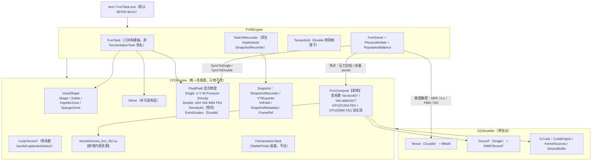

## 产品概述

修复 `FVMEngine\FVMEngine.vbproj` 与 `FVMEngine\test\test.vbproj` 使其可编译、可运行；并按用户要求，把 `CFDEngine` 与 `FVMEngine` 两个计算引擎重构为一个**混合精度 CFD 计算引擎**：CUDA 收益高的引擎内热点模块采用 Single 精度，其余 CPU 计算或精度要求高的部分采用 Double 精度，以此从根本上消除两个引擎之间的类型冲突。

## 核心功能

1. **两个项目编译通过**：消除 `FVMEngine` 与 `CFDEngine` 之间同名领域类型（`FluidField` / `VoxelShape` / `Stirrer` / `FermentationTank`）的二义性与接口实现不匹配。
2. **领域模型收敛为单一真相源**：以 `CFDEngine` 为唯一定义方，`FluidField` 采用「Single 主存储 + 惰性 Double 镜像」的混合精度结构；`FVMEngine` 删除自身的重复类型定义。
3. **FVM 热点模块 Single/GPU 化**：压力泊松 p′ Jacobi（每步 40 次扫描）、动量预估 Jacobi、七点 Laplacian 走 `TensorF` + CUDA（float32，显存内 ping-pong）。
4. **精度敏感模块保留 Double/CPU**：MRF 桨盘源项、k-ε 湍流闭包、PBM 群体平衡（破碎/聚并转移矩阵）、DO 传质与 kLa、诊断量统计。
5. **快照导出链路原生贯通**：`TankVtiRecorder` 恢复对 `ISnapshotRecorder` 的原生实现，产出的 `.vti` / `animation.pvd` / `frames.json` / `metadata.json` 与 `CFDEngine` 完全一致，可被 ParaView 与 CDFDxCanvas 直接加载。
6. **跑通测试**：编译后直接以默认参数（36×36×45 网格 / 240 步 / PBM 12 组 / 转速 120 rpm）运行 `FvmTank /demo`，正常导出全部帧与指标并退出码为 0。

## 技术栈

- 语言与框架：VB.NET，`net10.0`，`Microsoft.NET.Sdk`（SDK 10.0.401）
- Double 栈：`Microsoft.VisualBasic.MachineLearning.TensorFlow.Tensor`（`Data As Double()`），算子经 `tfMath`（`Tensor.computeKernel`）
- Single 栈：`TensorF`（另有 `TensorF.computeKernelF` / `ITensorComputeF` / `SIMDTensorF.Default`）
- GPU：`CFDEngine\CudaTensorF.vb`（`Inherits TensorComputeFBase`，NVRTC 内联 float32 内核，`TryRegister` 幂等且失败自动回落 SIMD；`ILCuda.CudaEngine.TryCreate` / `KernelSources.RegisterSource` / `DeviceBuffer(Of T)` / `LaunchPlanner.For1D(n, 256)`）
- 序列化：`System.Text.Json`（`SnapshotMetadata.ToJson()`）
- 依赖方向：`FVMEngine → CFDEngine → GCModeller`（**GCModeller 全程零改动**）

## 实现思路

分两步走，先「类型收敛 + 编译通过」，再「热点精度下沉」，每步都保持可编译可运行：

**第一步：领域模型收敛（消除冲突）**
把四套同名的领域类型收敛到 `CFDEngine` 一处，采用**只增不改**策略，保证 `StableFluidsSolver` / `VtiSnapshotRecorder` / `JsonSnapshotRecorder` / `VTKExporter` / `CudaTensorF` 一行不动。`FluidField` 变成混合精度容器：Single 的 `U/V/W/Pressure/Density`（`TensorF`，现有路径原样使用）+ 惰性 Double 镜像 `U64/V64/W64/P64/Density64` + `ExtraScalars As Dictionary(Of String, Tensor)`。`FVMEngine` 的 `FermentationTank`（几何构建器）与 `CFDEngine` 的 `FermentationTank`（StableFluids 容器）角色本质不同，不可合并，前者重命名为 `FvmTank`。

**第二步：热点精度下沉（混合精度）**
FVM 求解器每步约 1400 次张量运算，其中 `PressureCorrection` 的 40 次 p′ Jacobi 扫描约占 40%，是 GPU 收益最高的部分。把它与动量 Jacobi、七点 Laplacian 改到 `TensorF` 上执行，其余源项与闭包保留 `Tensor`。跨精度只在模块边界各做一次 `SyncToSingle` / `SyncToDouble`（成本 O(N)，远小于内部 O(40N)）。

## 关键决策与权衡

| 决策 | 理由 |
| --- | --- |
| **领域类型收敛到 CFDEngine，而非 FVMEngine 自包含** | `CFDEngine` 已是 NuGet 包（`GeneratePackageOnBuild=True`，`Version 1.0.9769.26878`）且被 CDFDxCanvas 等消费端依赖；它是唯一稳定的真相源。`FVMEngine` 自包含需复制约 200 行 VTI 写出逻辑，且要自行保证 ParaView 契约一致 |
| **混合精度本身不能消除冲突，必须先做类型收敛** | 冲突根源是两个**不同程序集**里的两个**不同类型**，只改精度不会变成同一类型；收敛后「Single 主存储 + Double 镜像」才有落点 |
| **`FermentationTank` 不合并，FVMEngine 侧改名 `FvmTank`** | 一个是 StableFluids 时间步进容器（持有 `StableFluidsSolver`、`StepForward(dt)`），一个是 FVM 几何体素化构建器（产出 `Dx/LiquidTop/ImpellerZ/SpargerZ/BaffleCount`）；强行合并会破坏 CFDEngine 公开 API |
| **变系数 Jacobi 不作为 `ITensorComputeF` 的 Override，改为 CFDEngine 内的独立算子服务 `FvmCompute`** | 现有 `JacobiStencil7` 是**等系数**七点模板（`alpha/beta` 标量 + `nFluid` 作除数），而 FVM 压力泊松是**逐面变系数**（`apfE/apfW/apfN/apfS/apfT/apfB`）。`ITensorComputeF` 是 GCModeller 的跨项目公共契约，扩展它会波及 TensorFlow / SPHEngine / MeshGraph。放在 CFDEngine 内的独立服务可做到 GCModeller 零改动，同时自带 GPU/SIMD 双实现 |
| **Double 镜像惰性构造** | `StableFluids` 路径永不触碰 `U64` 等属性 → CFDEngine 现有路径零内存回归（约 233 KB/场 × 5 场不会被额外分配） |
| **精度边界划分** | Single 用于**迭代式椭圆求解**：Jacobi 对舍入不敏感，40 次内迭代的截断误差会被 SIMPLE 外迭代吸收；Double 用于**源项与闭包**：含 `exp` / `pow(0.25)` / 矩阵归一化 / 比值型统计量（k-ε、PBM、kLa），误差会跨步累积 |
| **保留 `UseSingleBackend` 开关与自动回落** | 无 NVIDIA 设备 / NVRTC 编译失败 / 内核缺失时，自动走 `TensorF` + SIMD CPU 实现，甚至完全回退 Double 路径，保证任何环境下测试都能跑通 |


## 性能与可靠性

- **复杂度**：所有算子 O(N)，N = 36×36×45 = 58,320；压力泊松 O(40N)，动量 Jacobi O(N)。
- **当前瓶颈**：Double 张量 466 KB/个 > 85 KB LOH 阈值；每步约 1400 次 `tfMath` 运算 ≈ 0.7 GB LOH churn，240 步约 168 GB；且 `Tensor` 带 `Finalize()`，约 36 万个可终结对象。纯 Double CPU 路径预计数分钟至十几分钟。
- **缓解措施**：

1. 热点改 Single：单张量降至 233 KB，且 CUDA 路径下 Jacobi 全程驻留显存，**主机侧每步仅 1 次上传 + 1 次回读**，中间张量分配归零；
2. `test.vbproj` 增加 `<ServerGarbageCollection>true</ServerGarbageCollection>` 与 `<ConcurrentGarbageCollection>false</ConcurrentGarbageCollection>`；
3. `_act` / `_impZone` / `_spgZone` / `_topZone` / `_tx` / `_ty` / `_rPhys` 等静态几何张量在构造期一次性生成后长期复用，不进热点循环。

- **数值稳健**：保留现有的速度限幅（`clip_by_value(±4·TipSpeed)`）、`epsSafe/kSafe` 下限、`alpha` 的 `[0, 0.35]` 截断与 `d32` 的 `[d_min, d_max]` 截断；Single 化后额外对 `aPp` 对角加 `1e-6` 保护，避免除零放大。

## 架构设计



## 实现要点（防止回归）

- **CFDEngine 只增不改**：`VoxelShape` 新增构造函数重载与三个可选掩膜属性，原 `New(w,h,d,data)` 与 `FullBox/Capsule/Cylinder` 行为逐字节不变；`Stirrer` 仅把 6 个构造参数改为 `Optional`，原六参调用不变；`FluidField` 只加成员，现有 `Clone/CopyFrom/Clear/GetVoxel` 不动。
- **VB 命名空间陷阱**：`test.vbproj` 的 `RootNamespace` 必须从 `Moira.CFDEngine.Cli` 改为 `Moira.FVMEngine.Test`。VB 名字解析沿「RootNamespace 及其外层命名空间链」查找并**优先于 `Imports`**，维持原值会让未限定的 `FvmTank` / `FvmSolver` 绑到 `Moira.CFDEngine.*`。
- **PBM 字段上界**：`PopulationBalance.vb` 中 `Private _pbmD(PbmBins - 1) As Double` 等 6 处使用非 `Const` 的实例属性作字段数组上界，改为无界数组 `Private _pbmD() As Double`，由已有的 `InitPbm()` 中 `ReDim` 负责分配（行为等价，因 `InitPbm()` 在构造末尾调用）。
- **注册顺序**：CUDA 内核源码必须在 `CudaEngine.TryCreate` **之前**调用 `KernelSources.RegisterSource`；`FvmCompute.TryRegister` 沿用 `CudaTensorF.TryRegister` 的同构流程（幂等、失败返回 `False` 且不改后端、`LastError` 记录原因）。
- **变更半径**：不修改 `GCModeller` 任何文件；不修改 `CFDEngine` 的 `StableFluidsSolver` / `Snapshot/*` / `CudaTensorF`；`FVMEngine` 删除 `FluidField.vb` / `VoxelShape.vb` / `Stirrer.vb` 三个重复文件。
- **验证方式**：`dotnet build FVMEngine\FVMEngine.vbproj` → `dotnet build FVMEngine\test\test.vbproj` → 运行 `bin\Debug\net10.0\FvmTank.exe /demo`（默认 36/240），检查退出码、逐 12 步的进度输出、最终指标（功率 / Np / 气含率 / kLa / DO / d32）无 NaN，且 `tank_out` 下生成 13 帧 `.vti` + `animation.pvd` + `frames.json` + `metadata.json`。

## 目录结构

```
G:\Moira\src\
├── CFDEngine\
│   ├── CFDEngine.vbproj                      # [MODIFY] 增加 Kernels\moira_fvm_f32.cu 的 EmbeddedResource 声明；其余属性（RootNamespace/TFM/打包配置）保持不变
│   ├── VoxelShape.vb                         # [MODIFY] 新增 Solids / ImpellerZone / SpargerZone 三个可选掩膜属性；新增构造重载 New(w,h,d,data,[solids],[impellerZone],[spargerZone])；保留 Width/Height/Depth/Shape/TotalActive/IsActive/ToSolidMask/FullBox/Capsule/Cylinder 全部原样
│   ├── Application\Stirrer.vb                # [MODIFY] 六参构造改为 Optional，使 New Stirrer With {...} 可用；7 个属性与 ApplyToField / GetSurfaceVelocity / InjectDye 全部不动
│   ├── FluidField.vb                         # [MODIFY] 混合精度核心：保留 U/V/W/Pressure/Density As TensorF；新增惰性 Double 镜像 U64/V64/W64/P64/Density64、ExtraScalars As Dictionary(Of String, Tensor)、GetExtra(name)、SyncToDouble()、SyncToSingle()
│   ├── FvmCompute.vb                         # [NEW] 混合精度算子服务：UseSingleBackend / UseCudaBackend 开关，TryRegister(deviceOrdinal)、VarJacobi7（逐面变系数七点 Jacobi，显存内 ping-pong）、VarLaplacian7；GPU 不可用时回落 SIMD f32 CPU 实现
│   ├── Kernels\moira_fvm_f32.cu              # [NEW] 内联 float32 CUDA 源码：moira_fvm_jacobi_var（aE/aW/aN/aS/aT/aB/aDiag 逐格变系数）、moira_fvm_laplacian_var；网格布局 idx = i*(ny*nz)+j*nz+k
│   ├── CudaTensorF.vb                        # 不改动（等系数算子与 GpuProject 继续服务 StableFluids 路径）
│   ├── Application\FermentationTank.vb       # 不改动
│   └── Snapshot\**                           # 不改动
└── FVMEngine\
    ├── FVMEngine.vbproj                      # [MODIFY] 修正过期注释（RootNamespace 实为 Moira.FVMEngine）；显式声明 OutputType=Library；保留 6 个 GCModeller 引用 + CFDEngine 引用
    ├── FluidField.vb                         # [DELETE] 重复定义，改用 CFDEngine 的混合精度 FluidField
    ├── VoxelShape.vb                         # [DELETE] 重复定义，改用 CFDEngine 的扩展版 VoxelShape
    ├── Stirrer.vb                            # [DELETE] 重复定义（属性与 CFDEngine 版完全一致）
    ├── FermentationTank.vb → FvmTank.vb      # [RENAME+MODIFY] 类改名为 FvmTank（FVM 几何构建器）；内部构造统一 VoxelShape（传入 solids/impellerZone/spargerZone）与统一 FluidField；其余几何计算逻辑不变
    ├── TensorGrid.vb                         # [MODIFY] 保留为 Double 侧网格算子库；Wrap/Filled/MaskTensor 增加基于统一 FluidField 的便捷重载
    ├── FvmSolver.vb                          # [MODIFY] 场引用改为统一 FluidField 的 Double 镜像（U64/V64/W64/P64）；Tank 属性类型改为 FvmTank；PressureCorrection 与 MomentumPredictor 的 Jacobi 切换为 Single/TensorF 路径（经 FvmCompute），保留 Double 回退
    ├── PhysicsModels.vb                      # [MODIFY] MRF 源项 / k-ε / DO-kLa 保留 Double；Laplacian 与 UpwindOutflux 中可向量化部分按需走 Single
    ├── PopulationBalance.vb                  # [MODIFY] PBM 保留 Double（精度敏感）；6 处字段数组上界改为无界数组由 InitPbm 的 ReDim 分配
    ├── TankVtiRecorder.vb                    # [MODIFY] 恢复原生 Implements ISnapshotRecorder（field 已是统一 FluidField，签名天然匹配）；BuildFields 同时支持 Single 主场与 Double 扩展场
    └── test\
        ├── test.vbproj                       # [MODIFY] RootNamespace 改为 Moira.FVMEngine.Test（避开 Moira.CFDEngine 命名空间链优先解析）；增加 ServerGarbageCollection / ConcurrentGarbageCollection 设置；保留 6 个 GCModeller 引用 + CFDEngine + FVMEngine
        └── Program.vb                        # [MODIFY] Imports Moira.CFDEngine 改为 Imports Moira.FVMEngine；FermentationTank 改为 FvmTank；SnapshotMetadata.FromField 现可直接传入统一 FluidField，并补充 Simulation.Stirrer = StirrerInfo.FromStirrer(tank.Stirrer)
```

## 关键代码结构

```
' CFDEngine\FluidField.vb —— 混合精度容器（只增不改的核心契约）
Public Class FluidField
    ' Single 主存储（GPU/CUDA 高收益路径；StableFluids 原路径原样使用）
    Public Property U As TensorF
    Public Property V As TensorF
    Public Property W As TensorF
    Public Property Pressure As TensorF
    Public Property Density As TensorF

    ' Double 镜像（惰性构造，精度敏感：MRF / k-ε / PBM / DO / 诊断）
    Public ReadOnly Property U64 As Tensor
    Public ReadOnly Property V64 As Tensor
    Public ReadOnly Property W64 As Tensor
    Public ReadOnly Property P64 As Tensor
    Public ReadOnly Property Density64 As Tensor

    ' 扩展标量场（Double）：alpha_g / k / epsilon / DO / nut / kLa / d32 / n0 / pbm_i
    Public ReadOnly Property ExtraScalars As Dictionary(Of String, Tensor)
    Public Function GetExtra(name As String) As Tensor

    Public Sub SyncToDouble()   ' Single → Double（模块边界一次性提升）
    Public Sub SyncToSingle()   ' Double → Single（模块边界一次性回落）
End Class
```

```
' CFDEngine\FvmCompute.vb —— 变系数混合精度算子服务（GCModeller 零改动）
Public Class FvmCompute
    Public Shared Function TryRegister(Optional deviceOrdinal As Integer = -1) As Boolean
    Public Shared Sub Unregister()
    Public Shared Property LastError As String
    Public Shared ReadOnly Property Current As FvmCompute

    ''' 逐面变系数七点 Jacobi：整个迭代在显存内 ping-pong，主机侧仅一次上传 + 一次回读
    Public Function VarJacobi7(rhs As TensorF,
                               aE As TensorF, aW As TensorF, aN As TensorF,
                               aS As TensorF, aT As TensorF, aB As TensorF,
                               aDiag As TensorF, mask As Byte(),
                               iterations As Integer,
                               Optional initial As TensorF = Nothing) As TensorF

    ''' 逐面变系数七点 Laplacian
    Public Function VarLaplacian7(src As TensorF,
                                  aE As TensorF, aW As TensorF, aN As TensorF,
                                  aS As TensorF, aT As TensorF, aB As TensorF,
                                  aDiag As TensorF, mask As Byte()) As TensorF

    ''' 应用掩膜（GPU 不可用时 SIMD f32 回落）
    Public Sub ApplyMask(mask As Byte(), ParamArray fields As TensorF())
End Class
```

```
' CFDEngine\VoxelShape.vb —— 扩展构造（原 API 完全保留）
Public Class VoxelShape
    Public Sub New(width As Integer, height As Integer, depth As Integer, data As Boolean())

    ''' FVM 专用：附带固体 / 桨盘区 / 分布环掩膜
    Public Sub New(width As Integer, height As Integer, depth As Integer, data As Boolean(),
                   Optional solids As Boolean() = Nothing,
                   Optional impellerZone As Boolean() = Nothing,
                   Optional spargerZone As Boolean() = Nothing)

    Public ReadOnly Property Solids As Boolean()
    Public ReadOnly Property ImpellerZone As Boolean()
    Public ReadOnly Property SpargerZone As Boolean()
End Class
```

## Agent Extensions

### Skill

- **lsp-code-analysis**
- Purpose：在重命名 `FermentationTank → FvmTank`、删除 `FluidField.vb` / `VoxelShape.vb` / `Stirrer.vb`、迁移场引用 `U → U64` 的过程中，做符号级的定义/引用/实现导航与影响面分析，确保 12 个源文件中每一处调用点都被覆盖，避免漏改导致的编译回归。
- Expected outcome：产出完整的符号引用清单（尤其是 `FermentationTank`、`FluidField`、`VoxelShape`、`Stirrer`、`.U` / `.V` / `.W` / `.Pressure` / `.Density` 的全部引用位置），使重构后一次性编译通过。

### SubAgent

- **code-explorer**
- Purpose：在新增 `FvmCompute` 与 `Kernels\moira_fvm_f32.cu` 前，核查 `CudaTensorF` 的注册流程、`ITensorComputeF` 成员清单、`TensorF` 的构造与 `Wrap` 工厂签名、以及 `StableFluidsSolver.UseCudaBackend` 的既有开关范式，确保新内核与既有 CUDA 后端风格一致且可复用其缓冲管理策略。
- Expected outcome：给出精确的 `TensorF` API 契约与 CUDA 注册/启动范式，使新增的变系数内核一次编译通过并能在无 GPU 时正确回落 SIMD。