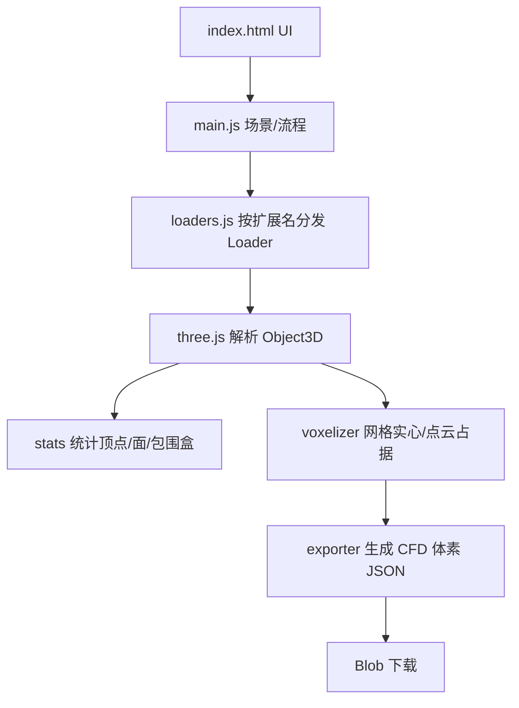

## 用户需求

使用 HTML + JavaScript + three.js 编写一个 Web 应用，从当前 wwwroot 文件夹（通过 http://localhost 访问）请求三维模型文件并在浏览器中显示，同时支持将模型体素化并导出用于 CFD 流体仿真的体素 JSON。

## 产品概述

一个桌面端单页 Web 工具：左侧为控制与属性面板，右侧为 three.js 三维视口。可加载本地服务器上的模型文件，实时展示几何属性，并提供可调分辨率的实心体素化与 JSON 下载能力。

## 核心功能

- 按相对路径请求模型文件（默认 airplane1.3mf），支持格式：3mf、obj、stl（ASCII/二进制）、ply（点云或网格）、COLLADA(.dae)、glb、gltf、max3ds(.3ds)。
- 三维场景渲染：轨道控制器、地面网格、坐标轴、光照，模型自动居中。
- 模型属性统计并显示：顶点总数、三角面/面总数、对象数、包围盒尺寸；点云显示点数。
- 体素化：网格模型实心体素化（三角网格内部体素标记为 1），点云按占据体素标记（点所在体素为 1）；分辨率用户可调（默认 64³）。
- 体素数据为一维整数数组：0=外部/流体空间，1=固体边界；索引公式 index = (x * Height + y) * Depth + z。
- 导出自定义 JSON：包含 schema、网格维度、包围盒与体素尺寸、坐标系、索引公式、数值语义、固体体素数、源模型名与 data 数组，供 CFD 引擎加载。

## 技术栈

- 前端：HTML5 + 原生 JavaScript（ES Modules），无需构建步骤，由当前 wwwroot 静态服务。
- 渲染与加载：three.js r0.160（通过 CDN importmap 引入 three 及 examples/jsm 各格式 Loader）。
- 数据导出：浏览器原生 Blob + 下载，JSON 自定结构。

## 实现方案

### 总体策略

单页工具，index.html 提供布局与 importmap，js/ 下按职责拆分为 loaders（格式分发）、voxelizer（体素化）、exporter（JSON 导出）、main（场景与流程编排）。加载流程：fetch 相对路径模型 → 按扩展名选择 three.js Loader.parse → 遍历场景图收集三角形（应用世界矩阵）与点云 → 统计属性 → 体素化 → 导出下载。

### 关键技术决策

- 格式分发：建立扩展名到 Loader 的注册表（3MFLoader / OBJLoader / STLLoader / PLYLoader / ColladaLoader / GLTFLoader / 3DSLoader）。GLTFLoader 需设置 base URL 以加载外部 .bin/纹理；.glb 自包含。PLYLoader 输出可能是 Points 或 Mesh，需分别处理。
- 体素化算法（网格实心）：计算世界包围盒并按用户分辨率在各轴划分 W×H×D。对每个 (y,z) 列沿 x 轴做射线与三角形求交计数，奇数为内部 → 标记 1（实心填充）。为避免朴素 O(体素数×三角数) 爆炸，先做逐列候选三角形过滤（用三角形包围盒剔除不交该列的三角形），再做 x 排序求交计数。
- 点云体素化：将每个点映射到其所在体素并标记为 1（占据语义，不做实心填充）。
- 数据表示：使用 Uint8Array 存 data（内存高效），导出时序列化为 number[]；分辨率 >128³ 时附加 RLE 压缩字段，raw 仍为默认主交付。
- 主线程分块处理（按列分片 + 进度回调）避免界面冻结；如需更高分辨率后续可迁移 Web Worker。

### 实现注意

- 复用 three.js 内置 Loader，不自行解析二进制格式；STLLoader 自动识别 ASCII/二进制。
- 错误兜底：fetch 失败、格式不支持、解析异常均在底部状态栏提示，不中断场景。
- 性能热点在体素化；默认 64³（约 26 万体素）主线程可接受；通过候选三角形过滤将复杂度从 O(N·T) 降至接近 O(N·T_column)。
- 不修改任何既有文件（文件夹仅含测试模型），所有新增文件互不耦合，向后兼容。

## 架构设计



## 目录结构

```
g:/Moira/src/3d/
├── index.html          # [NEW] 页面结构、three.js importmap(CDN)、UI 布局容器（头部/侧栏/视口/状态栏）
├── styles.css          # [NEW] 暗色玻璃拟态主题样式，面板/按钮/进度条/状态栏
├── js/
│   ├── loaders.js      # [NEW] 扩展名→Loader 注册表；fetch ArrayBuffer/文本后调用对应 parse，统一输出三角形与 Points 数据
│   ├── voxelizer.js    # [NEW] 网格实心体素化（射线奇偶+候选过滤）与 点云占据体素化，返回 Uint8Array 与维度/体素尺寸
│   ├── exporter.js     # [NEW] 组装 CFD 体素 JSON（schema/grid/bounds/索引公式/语义/data）并提供 Blob 下载
│   └── main.js         # [NEW] three.js 场景搭建、属性面板刷新、UI 事件绑定、加载/体素化/下载流程编排
└── airplane1.3mf       # [EXISTING] 用户提供的测试模型，由 wwwroot 直接服务
```

## 关键代码结构

```typescript
// 体素化导出 JSON 核心结构（CFD 加载所需全部信息）
interface VoxelGridFile {
  schema: "Moira.CFD.VoxelGrid/v1";
  grid: { width: number; height: number; depth: number };
  bounds: {
    min: [number, number, number];
    max: [number, number, number];
    size: [number, number, number];
    voxelSize: [number, number, number];
  };
  coordinateSystem: string;            // "right-handed, Y-up (three.js world)"
  indexFormula: string;                // "index = (x * height + y) * depth + z"
  encoding: "raw" | "rle";
  valueSemantics: { "0": string; "1": string };
  solidVoxelCount: number;
  sourceModel: string;
  data: number[];                      // length = width*height*depth
}

// 体素化函数签名
function voxelizeMesh(triangles: Float32Array, bbox: Box3, resolution: number):
  { data: Uint8Array; dims: [number, number, number]; voxelSize: number[] };
function voxelizePoints(points: Float32Array, bbox: Box3, resolution: number):
  { data: Uint8Array; dims: [number, number, number]; voxelSize: number[] };
```

## 设计风格

采用现代暗色玻璃拟态（Glassmorphism）科技风，面向桌面端的三维查看与 CFD 体素化工具。左侧半透明磨砂面板承载控制与属性，右侧大面积深色视口展示模型，青蓝霓虹点缀强调操作，整体专业、冷静、具有工程质感。

## 页面区块（单页工具，自上而下）

- 顶部导航栏：应用标题“Moira 3D 查看与体素化”；模型相对路径输入框（默认 airplane1.3mf）；加载按钮；本地文件上传入口；整体玻璃条悬浮于视口上方。
- 左侧属性面板：动态显示顶点数、三角面数、对象数、包围盒尺寸；点云额外显示点数；卡片式分区，数值高亮。
- 左侧体素化面板：分辨率输入框（默认 64，可选 32/64/128/256）；体素化按钮；进度条；下载 JSON 按钮；0/1 语义图例。
- 主视口：three.js 画布，轨道控制器、地面网格、坐标轴与三点光照；模型自动居中，低分辨率可选 InstancedMesh 体素预览。
- 底部状态栏：加载/解析状态、错误提示、体素化耗时与固体体素数，常驻显示。

## Agent Extensions

### Skill

- **playwright-cli**
- 用途：在编写完成后自动打开 http://localhost/index.html，验证模型加载、属性显示与体素 JSON 下载流程。
- 预期结果：页面正常渲染 airplane1.3mf，属性面板显示顶点/面数，点击体素化与下载可生成并保存 CFD 体素 JSON，无控制台报错。