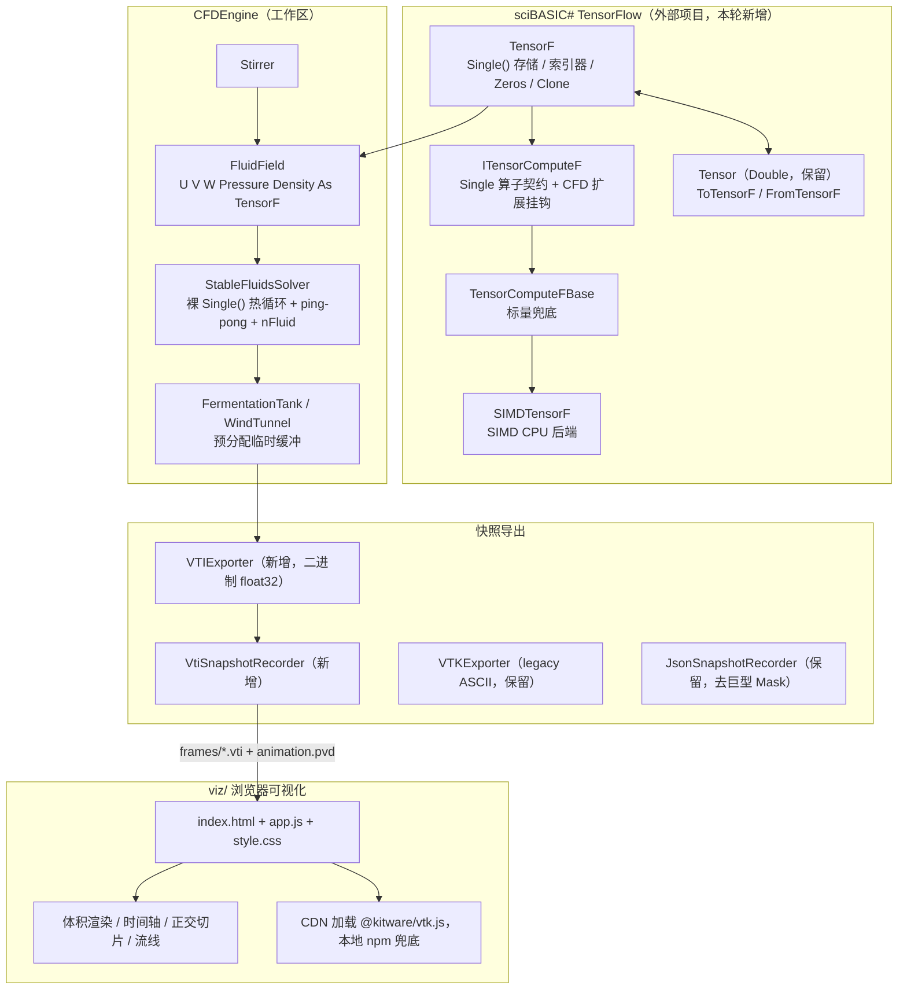
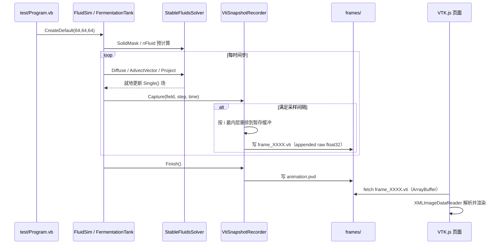

## 产品概述

对 VB.NET 计算流体力学引擎 `CFDEngine` 做一轮可验证的性能与精度改造：先把求解器内部数据从 `Double`/`Tensor` 迁移到 `Single`，同时在底层 sciBASIC# TensorFlow 库中新增一个 Single 精度张量对象（为后续 GPU 后端留位），完成 P0 级 CPU 热点优化；随后以 64³ 网格跑通 demo；最后新增二进制 `.vti` 导出与基于 VTK.js 的浏览器可视化页面，使用户能直接查看优化后的仿真结果。

## 核心功能

1. **Single 精度张量栈**：在底层 TensorFlow 项目新增 `TensorF`（`Single()` 存储）及其可插拔计算后端契约与 SIMD 实现，并与现有 `Double` 版 `Tensor` 双向互转。
2. **求解器 P0 优化**：消除索引器原子操作、消除 Jacobi 每轮克隆分配、消除热循环内的固体判定函数调用、合并速度三分量平流、改善 stencil 访存局部性。
3. **引擎切换 Single**：`FluidField` / `Stirrer` / `FermentationTank` / `WindTunnel` / 快照导出器全部适配 Single 存储，同时保持对外索引器语义不变。
4. **二进制 .vti 导出**：新增 VTK XML ImageData 导出器，float32、去派生场、可选 zlib，替代体积灾难的 JSON 快照。
5. **64³ demo 跑通**：命令行可调规模与采样间隔，输出 `.vti` 序列，并输出耗时统计用于与改造前基线对比。
6. **VTK.js 可视化**：体积渲染 + 传输函数、时间轴播放、正交切片、流线/矢量箭头四项全量，CDN 加载 + 本地 npm 兜底。

## 边界

- 本轮不实现 GPU kernel，只搭好 Single 张量栈与后端接口。
- 本轮只保证 64³ 全流程可用，128³ 留后续验证，但代码必须能在 128³ 下正确运行。
- 不移除 sciBASIC# TensorFlow 依赖。
- 不改动 `VoxelShape` 的索引约定 `i*ny*nz + j*nz + k`。
- 不破坏 `WindTunnelTest` 的任何断言。

## 技术栈

- 语言与框架：VB.NET，.NET 10（`net10.0`），SDK 风格项目（新增 `.vb` 自动纳入编译，无需改 csproj）
- 底层张量库：`G:\GCModeller\src\runtime\sciBASIC#\Data_science\MachineLearning\TensorFlow\TensorFlow.vbproj`（RootNamespace `Microsoft.VisualBasic.MachineLearning.TensorFlow`）
- SIMD：`Microsoft.VisualBasic.Math.SIMD` 的 `SimdEngine` / `SimdMath` / `SimdReduce` / `SimdParallel`（泛型助手，可直接服务 `Single`；`Vector(Of Single)` 在 AVX2 下 8 lane，是 Double 的 2 倍吞吐）
- 数据格式：VTK XML `ImageData`（`.vti`）+ ParaView `.pvd` 时间集合
- 前端：原生 HTML + ES Module，CDN（unpkg / jsdelivr）加载 `@kitware/vtk.js`，失败时回退本地 `node_modules`
- 本地服务：`python -m http.server` 或 `npx serve`（`file://` 下 fetch 不可用，必须走 HTTP）

## 实现方案

### 总体策略

分五阶段推进，每阶段可独立编译验证：先建底层 Single 张量栈，再切引擎，再做 P0 优化，再换导出格式，最后做可视化。核心思路是**把热点循环从"Tensor 索引器"降级为"裸 `Single()` 数组 + 手写线性索引"**，同时保留 `TensorF` 作为对外的数据容器与未来 GPU 承载体。

### 关键技术决策

**决策 1：为什么必须新建 `TensorF` 而不是改 `Tensor`**
`Tensor` 的 `_Data` 是 `Double()`，且被深度学习、自动微分等大量既有代码依赖，直接改精度会波及整个 sciBASIC# 生态。新建并列的 `TensorF` 类型，通过 `ToTensor()` / `ToTensorF()` 双向互转，风险可控且符合用户"保留依赖"的要求。

**决策 2：`TensorF` 索引器绝不带版本计数**
现有 `Tensor` 的三维索引器 Setter 内含 `Interlocked.Increment(_version)`，每次写入都是带 lock 前缀的原子操作 + 全内存屏障。128³ 下仅压力泊松迭代就是 `30 × 2.1M = 6300 万次/步`。`TensorF` 只做纯数组读写，版本号改为可选、默认关闭。

**决策 3：Jacobi 改为预分配 ping-pong，禁止迭代内 Clone**
现状每次迭代 `Clone()` 一个张量，128³ 下约 150 次 16.8 MB 分配/步，折合 **2.5 GB/步 GC 压力**。改为求解器持有两份预分配 `Single()`，每轮交换引用或 `Array.Copy`。

**决策 4：固体掩膜由"运行时判定"改为"预计算 + 内联索引"**
`Project` 的泊松内层每格调用 7 次 `IsSolid(...) × 30 迭代 = 210 次/格 → 4.4 亿次函数调用/步`。改为构造期预计算 `nFluid() As Byte`（每格流体邻居数），热循环直接 `p(idx) = (sum - div(idx)) / nFluid(idx)`，分支与函数调用全部消除；`SolidMask` 由 `Boolean()` 改 `Byte()`。

**决策 5：合并三分量平流**
现状 `Advect` 对 U/V/W 各调一次，回溯坐标与 8 个角点权重完全相同却算 3 遍。新增 `AdvectVector` 一次算权重、三次取值，省约 2/3 的三线性采样开销。

**决策 6：stencil 分块遍历**
内存布局 `idx = (i*ny + j)*nz + k`，最内层 k 连续；而 Jacobi 需要 i±1，跨度 `ny*nz`（128³ 时 128 KB），6 个邻居 6 次 cache miss。改为按 i 方向分块（每块 8~16 层）的外层遍历，使块内切片常驻 cache。

**决策 7：导出格式选 `.vti` 而非 Zarr/HDF5**
用户本轮明确要 VTK.js，而 VTK.js 的 `XMLImageDataReader` 原生吃 `.vti`。Zarr/HDF5 需要额外前端解码器，留作后续大数据量优化。`.vti` 默认 **appended + `encoding="raw"` + 不压缩**（最保守、一定被支持），zlib 作为可选开关。

**决策 8：导出字段精简**
去掉 JSON 时代冗余的 `speed` 标量与 3N 的 `velocity` 交错数组重复，只落 `mask`(UInt8)、`pressure`(Float32)、`density`(Float32)、`velocity`(Float32×3 向量)。64³ 单帧约 5.2 MB，配合采样间隔 10，20 帧约 104 MB，浏览器可承受。

### 性能与可靠性

- 复杂度：单次时间步仍为 O(N × JacobiIterations)，但常数因子大幅下降。预期 P0 + Single 合计 **10~30 倍**加速（Single 本身贡献约 2 倍内存带宽与 cache 收益）。
- 瓶颈：压力泊松的 30 次 Jacobi 仍占主导；本轮不改迭代次数（避免改变数值行为），留待后续阶段换 CG / 多重网格。
- 数值可靠性：Single 相对 Double 有约 1e-7 相对误差，回归验证需按 float32 容差（相对误差 1e-4）而非精确比对。
- 可靠性：`WindTunnelTest` 的 5 条断言（无 NaN、enstrophy > 0、尾流亏损 > 0、最大速度达来流量级、网格维度正确）必须全部保持 PASS。

## 实现要点（执行细节）

1. **先采集基线**：任何改动前，用当前代码以 64³ 跑一次，记录每步耗时与总耗时。否则无法证明优化收益。
2. **保持索引器语义**：VB 在 `OptionStrict Off` 下 Single→Double 是隐式拓宽转换。只要 `TensorF` 保留 `Default Property Item(i, j, k)`，`VTKExporter.vb`、`WindTunnel.vb`、`test/Program.vb`、`test/WindTunnelTest.vb` 中绝大多数 `f.U(i,j,k)` 调用点**无需改动**。真正要改的只有：`As Tensor` 签名、`.Data`（`Double()` → `Single()`）、以及显式 `Double` 局部变量。
3. **VTK ImageData 的"x 最快"约定**：现有 legacy `VTKExporter` 用 `For k / For j / For i`（i 最内层）配合 `DIMENSIONS nx ny nz`，是正确的。新 `.vti` 导出器必须沿用同一顺序，否则 ParaView / VTK.js 中流场会转置错乱。
4. **SolidMask 只在构造期计算一次**：`VoxelShape.ToSolidMask()` 现在返回 `Boolean()`，改造时一并缓存 `nFluid`，避免每步重算。
5. **不要动 `VoxelShape` 的索引约定**：`i*ny*nz + j*nz + k` 是全局契约，改动会波及体素模型加载、风洞域构建与掩膜。
6. **临时缓冲提取为字段**：`FermentationTank.StepForward` 与 `WindTunnel.StepForward` 每步 `New Tensor(nx,ny,nz)` 3~4 个，必须提到实例字段预分配并在首次 `StepForward` 时按网格尺寸创建。
7. **`metadata.json` 20 MB 问题的止血**：`SnapshotMetadata` 把 2,097,152 个整数的 Mask 用 `WriteIndented` 逐行写出。本轮默认快照格式切到 `Vti` 后该路径不再是默认路径，但仍应改为紧凑序列化或改为不落盘 Mask。
8. **VTK.js 必须走 HTTP**：`file://` 协议下 `fetch` 被浏览器阻止，README 必须写明启动方式。
9. **VTK.js 加载失败要有可见提示**：CDN 不可达时在页面顶部显示明确错误与 `npm i @kitware/vtk.js` 的兜底指引，而不是白屏。

## 架构设计

### 分层结构



### 数据流



## 目录结构

```
G:/GCModeller/src/runtime/sciBASIC#/Data_science/MachineLearning/TensorFlow/
├── TensorF.vb                        # [NEW] Single 精度张量本体。Single() 存储；Shape / Length / Rank；一维/二维/三维/N 维索引器（严禁 Interlocked）；Zeros / Ones / Filled / Scalar / Clone / Dispose / Create 包装构造；ToTensor() 转 Double 版。索引器是 CFDEngine 热循环之外的对外兼容面。
├── Tensor.vb                         # [MODIFY] 新增 ToTensorF() 与 TensorF.FromTensor() 两个互转方法，保持双向互通，不改动任何既有行为。
└── Compute/
    ├── ITensorComputeF.vb            # [NEW] Single 版算子契约。精简镜像（逐元素二元/一元、标量运算、归约、MatMul），并额外定义 CFD 扩展段（七点 stencil、三线性 gather、按掩膜置零），为后续 CudaTensorF 在 GPU 上实现留位。
    ├── TensorComputeFBase.vb         # [NEW] 对应 TensorComputeBase 的标量兜底实现，提供 MapBinary / MapUnary / RequireSameShape / Wrap 等 Protected helper。
    └── SIMDTensorF.vb                # [NEW] SIMD CPU 后端，复用 Microsoft.VisualBasic.Math.SIMD 的泛型助手（Vector(Of Single) 8 lane）；暴露 Shared Default 与 Shared Register()，结构与 SIMDTensor 一致。

g:/Moira/src/CFDEngine/
├── FluidField.vb                     # [MODIFY] U/V/W/Pressure/Density 由 Tensor 改 TensorF；构造函数改用 TensorF.Zeros；Clear/CopyFrom 适配 Single()；保留 Item(i,j,k) 语义使上层调用点不动；新增可选的 Double 侧互转属性。
├── StableFluidsSolver.vb             # [MODIFY] 本轮核心。热循环改裸 Single() 与 idx 增量自增；新增预分配 ping-pong 缓冲替换每次迭代 Clone()；构造期预计算 nFluid() As Byte 并内联 SolidMask；新增 AdvectVector 合并三分量平流；Jacobi/stencil 改为分块遍历；SolidMask 由 Boolean() 改 Byte()。
├── FermentationTank.vb               # [MODIFY] u1/v1/w1/d1 临时缓冲提取为预分配实例字段；GetVelocityU 等返回 TensorF；新增 ToTensor() 兼容重载；Viscosity/Diffusion 计算沿用时转 Single。
├── WindTunnel.vb                     # [MODIFY] 同上；ComputeEnstrophy / ComputeMaxSpeed 等统计函数适配 Single 并累加用 Double 以防精度损失。
├── Stirrer.vb                        # [MODIFY] ApplyToFieldInternal 参数由 Tensor 改 TensorF；其余因索引器语义保持而无需改动。
├── FluidSim.vb                       # [MODIFY] CreateRecorder 增加 SnapshotFormat.Vti 分支；默认格式改为 Vti。
├── Snapshot/
│   ├── VTIExporter.vb                # [NEW] VTK XML ImageData 二进制导出器。WholeExtent + Origin + Spacing；PointData 含 mask(UInt8)、pressure(Float32)、density(Float32)、velocity(Float32×3)；写数顺序沿用 For k / For j / For i（i 最内层，符合 VTK x 最快约定）；默认 appended + encoding="raw" 不压缩，支持可选 vtkZLibDataCompressor。
│   ├── VtiSnapshotRecorder.vb        # [NEW] 实现 ISnapshotRecorder，逐帧写 .vti 并在 Finish() 写 animation.pvd；沿用零内存驻留策略与采样间隔过滤。
│   ├── SnapshotFormat.vb             # [MODIFY] 枚举新增 Vti 项。
│   ├── VTKExporter.vb                # [MODIFY] 适配 Single()（索引器读取自动拓宽，主要改显式 Double 局部变量与 CSV 切片导出）。
│   └── JSON/
│       ├── JsonSnapshotRecorder.vb   # [MODIFY] 适配 Single()；去掉派生的 speed 与重复的 velocity 交错数组。
│       └── SnapshotMetadata.vb       # [MODIFY] Mask 不再用 WriteIndented 逐行写出（实测导致 metadata.json 达 20 MB），改紧凑序列化或按开关控制。
└── test/
    ├── Program.vb                    # [MODIFY] 默认网格改 64³；新增 --size N / --steps N / --interval N；默认快照格式改 Vti（默认 steps=200、interval=10）；打印每步耗时与总耗时。
    └── WindTunnelTest.vb             # [MODIFY] 若有显式 Double 局部变量需适配；断言逻辑保持不变，作为回归验证入口。

g:/Moira/src/CFDEngine/viz/
├── index.html                        # [NEW] 页面骨架：顶部导航、左侧控制面板、中央 3D 视口、底部时间轴、右下状态栏。ES Module 入口，CDN 加载 @kitware/vtk.js，失败时显示本地 npm 兜底指引。
├── app.js                            # [NEW] 全部交互逻辑：XMLImageDataReader 加载 .vti 序列；vtkVolume + vtkVolumeMapper 体积渲染与传输函数；时间轴播放/暂停/拖动；X/Y/Z 正交切片可拖动；velocity 场的 StreamLine / Glyph；场（density/speed/pressure）切换；FPS 与帧信息显示。
├── style.css                         # [NEW] 深色科学仪表盘样式：玻璃拟态面板、青色/琥珀色强调色、响应式布局、控制面板折叠。
├── README.md                         # [NEW] 使用说明：如何启动本地 HTTP 服务、如何放置 frames 目录、CDN 失败时如何改用本地 node_modules、参数说明。
└── serve.ps1                         # [NEW] 一键启动本地静态服务的 PowerShell 脚本（优先 python -m http.server，其次 npx serve）。
```

## 关键代码结构

**TensorF 核心形态（索引器不得包含任何原子操作）**

```
Namespace Microsoft.VisualBasic.MachineLearning.TensorFlow

    Public Class TensorF
        Implements IDisposable

        Private _Data As Single()
        Private _Shape As Integer()

        Public ReadOnly Property Data As Single()
        Public ReadOnly Property Shape As Integer()
        Public ReadOnly Property Length As Integer
        Public ReadOnly Property Rank As Integer

        Default Public Property Item(index As Integer) As Single
        Default Public Property Item(row As Integer, col As Integer) As Single
        Default Public Property Item(row As Integer, col As Integer, depth As Integer) As Single
        Default Public Property Item(indexes As Integer()) As Single

        Public Shared Function Zeros(shape As Integer()) As TensorF
        Public Shared Function Filled(shape As Integer(), value As Single) As TensorF
        Public Shared Function Wrap(data As Single(), shape As Integer()) As TensorF
        Public Shared Function FromTensor(t As Tensor) As TensorF

        Public Function ToTensor() As Tensor
        Public Function Clone() As TensorF
        Public Sub Dispose() Implements IDisposable.Dispose

        Public Shared Property computeKernelF As Compute.ITensorComputeF
        Public Shared ReadOnly SyncRoot As New Object()
    End Class

End Namespace
```

**Single 算子契约的 CFD 扩展段（为 GPU 后端预留）**

```
Namespace Compute

    Public Interface ITensorComputeF
        ReadOnly Property Name As String

        ' 逐元素 / 标量 / 归约（精简镜像，与 Double 栈同构）
        Function Add(a As TensorF, b As TensorF) As TensorF
        Function MultiplyScalar(t As TensorF, scalar As Single) As TensorF
        Function SumAll(t As TensorF) As Double

        ' CFD 扩展：GPU 后端将来必须实现的三个原语
        '   Stencil7   : 七点拉普拉斯，按掩膜处理固体邻居（Neumann 零梯度）
        '   Gather3D   : 半拉格朗日回溯的三线性 gather（scatter-free）
        '   ApplyMask  : 按掩膜把指定单元置零
        Function Stencil7(src As TensorF, nFluid As Byte(),
                          out As TensorF, alpha As Single, beta As Single) As TensorF
        Function Gather3D(src As TensorF,
                          u As TensorF, v As TensorF, w As TensorF,
                          dt As Single, out As TensorF) As TensorF
        Sub ApplyMask(ParamArray fields As TensorF())
    End Interface

End Namespace
```

**.vti 文件骨架（appended raw，i 最内层重排后写出）**

```
<VTKFile type="ImageData" version="1.0" byte_order="LittleEndian" header_type="UInt32">
  <ImageData WholeExtent="0 63 0 63 0 63" Origin="0 0 0" Spacing="1 1 1">
    <Piece Extent="0 63 0 63 0 63">
      <PointData>
        <DataArray type="UInt8"   Name="mask"     format="appended" offset="0"   />
        <DataArray type="Float32" Name="pressure" format="appended" offset="..." />
        <DataArray type="Float32" Name="density"  format="appended" offset="..." />
        <DataArray type="Float32" Name="velocity" NumberOfComponents="3" format="appended" offset="..." />
      </PointData>
      <CellData />
    </Piece>
  </ImageData>
  <AppendedData encoding="raw">
    _BINARY...
  </AppendedData>
</VTKFile>
```

## 设计风格

科学计算可视化控制台风格，深色底 + 玻璃拟态面板 + 青色/琥珀色强调。整体氛围接近 CFD 后处理工作站（ParaView / Tecplot 的现代版），强调信息密度与可操作性，而非营销型页面。所有面板使用半透明深色玻璃层叠加在纯黑视口之上，边界用 1px 低对比描边分隔，控件采用扁平化滑块与分段按钮，避免拟物阴影。

## 页面结构（单页，自上而下分块）

1. **顶部导航栏**：左侧产品标识「CFDEngine 仿真结果查看器」与数据集名称；中部显示当前帧序号、模拟时间、网格尺寸；右侧显示数据加载状态与渲染后端（WebGL2）。高度固定，背景为最深的玻璃层。
2. **中央 3D 视口**：占据页面主要面积，VTK.js 全屏渲染。默认展示密度场的体积渲染；支持鼠标左键旋转、滚轮缩放、右键平移。视口左下角叠加一个小型坐标轴指示器，右下角叠加颜色条图例。
3. **左侧控制面板**：可折叠的玻璃面板，自上而下分为四组——「体绘制」（开关、场选择 density/speed/pressure、传输函数滑块组：不透明度下限/上限、颜色映射预设）、「切片」（X/Y/Z 三个开关与位置滑块）、「流线」（开关、种子点密度、积分步长、显示箭头/流线切换）、「显示」（背景色、边框、坐标轴）。
4. **底部时间轴**：整条通栏。左侧播放/暂停按钮与帧率选择；中部为可拖动的进度条，刻度标注帧序号与模拟时间；右侧上一帧/下一帧按钮与循环开关。拖动时实时加载对应 `.vti` 并显示加载进度。
5. **右下状态栏**：显示 FPS、当前帧已加载 MB 数、全场最大速度、平均速度。数值用等宽字体对齐。

## 交互与动效

- 面板折叠使用高度过渡；滑块拖动时数值实时更新并带轻微高亮；时间轴拖动时视口做平滑的场切换，加载中显示细长进度条。
- 场切换与传输函数调整使用短暂的交叉淡入，避免突变闪烁。
- 所有加载失败（CDN 不可达、帧文件缺失）在页面顶部显示明确的错误条与修复指引，而非白屏。

## 响应式

- 桌面优先，最小支持 1280×720。
- 窗口宽度小于 1100px 时左侧控制面板自动折叠为图标条，点击展开为浮层。
- 视口尺寸随窗口自适应，VTK.js 渲染窗口监听 resize 并重设画布。

## Agent Extensions

### Skill

- **lsp-code-analysis**
- 用途：在把 `Tensor` 切换为 `TensorF` 的改造中，精确查找 `As Tensor` 签名、`Tensor.Zeros`、`.Data`、`Clone()` 的全部定义与引用点，做影响面分析，避免遗漏调用点导致编译失败。
- 预期结果：得到完整的影响点清单（尤其是 `Stirrer.ApplyToFieldInternal`、`FermentationTank.GetVelocityU/V/W`、`WindTunnel`、`JsonSnapshotRecorder`），确保改造一次编译通过。

- **playwright-cli**
- 用途：启动本地静态服务后，自动化打开 `viz/index.html`，截图并抓取控制台错误，验证 `.vti` 序列确实被加载、体积渲染/切片/流线渲染无 JS 异常。
- 预期结果：拿到页面渲染截图与控制台错误清单，确认可视化链路端到端可用后再交付给用户查看。