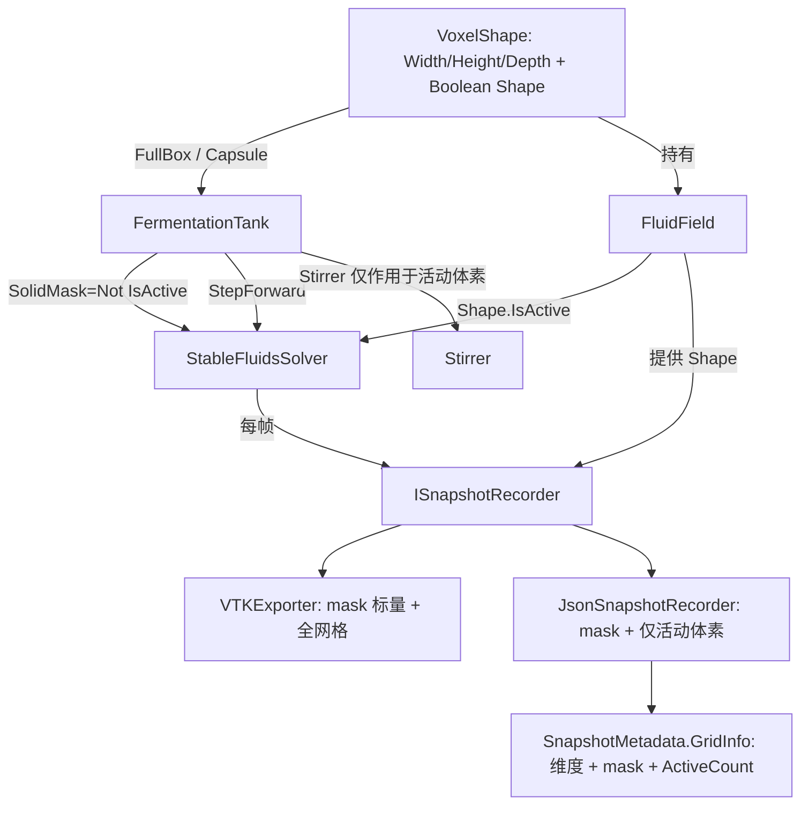

## 用户需求概述

把 CFD 计算引擎的容器空间模型从"仅由 nx×ny×nz 定义的长方体"升级为"由一维逻辑向量 `shape As Boolean()` 表示的三维体素模型"，并用该模型定义 CFD 计算空间；同时把该不规则体素定义同步应用到快照系统。

## 核心特性

- **三维体素空间模型**：新增体素空间对象，用一维数组 `Boolean()` 表示三维布尔数组 `boolean(,,)`，维度由 `width/height/depth` 标记；索引 `index = (x * HEIGHT + y) * DEPTH + z`（等价于现有 `i*Ny*Nz + j*Nz + k`）。`true`=模拟空间体素，`false`=空腔（不属于计算空间）。
- **胶囊体素生成器**：提供沿 Z 轴竖直放置的胶囊（圆柱段+两端半球）三维体素模型生成方法，可直接加载进引擎。
- **实体障碍式求解**：标记 `false` 的体素视为实体障碍物——速度/压力强制为 0、表面作无滑移壁面、压力投影中排除固体单元，物理上正确定义非规则计算空间。
- **向后兼容**：保留并复用现有长方体工厂与 nx×ny×nz 构造路径（内部构造全 true 的体素模型）。
- **快照系统升级**：VTK 保留完整 STRUCTURED_POINTS 网格并新增 `mask` 标量（1=活动, 0=空腔）；JSON 写入 `mask` 且仅导出活动体素数据以降低冗余；元数据记录体素维度与掩膜。

## 视觉/数据效果

- 模拟结果在非规则胶囊空间内求解；胶囊外体素速度场为 0，形成清晰壁面。
- 快照文件可用 ParaView/JSON 阅读器还原胶囊形状计算域，活动体素与空腔由 mask 区分。

## 技术栈

- 语言：VB.NET（.NET 10，LangVersion 16.9，OptionInfer On）
- 数据结构：`Microsoft.VisualBasic.MachineLearning.TensorFlow.Tensor`（三维速度/压力/密度场）
- 快照格式：Legacy VTK（STRUCTURED_POINTS）+ JSON（metadata.json + frame_xxx.json）
- 延续现有模式：零内存驻留写盘、接口 `ISnapshotRecorder` 多态、工厂方法 `FluidSim.CreateXxx`

## 实现方案

**总体策略**：引入新的 `VoxelShape` 几何模型作为"计算空间真相源"，`FluidField` 持有该模型并暴露 `IsActive(i,j,k)`；`StableFluidsSolver` 增加 `SolidMask` 属性并在扩散/平流/投影/边界中逐体素判定固体；`FermentationTank`/`Stirrer` 接受并按 shape 约束计算；快照系统读取 `FluidField.Shape` 写出 mask 与活动体素数据。

**关键决策与权衡**

1. **索引一致性**：`VoxelShape.Index(x,y,z) = (x*Height + y)*Depth + z`，映射 `Width↔Nx, Height↔Ny, Depth↔Nz`，与现有 Tensor 布局、`GridInfo.IndexOrder="i*ny*nz+j*nz+k"`、JSON 扁平数组顺序严格一致，避免任何重排。
2. **求解器固体处理（无条件稳定，保持教学特性）**：

- `Advect`：跳过固体单元（保持 0）；回溯采样读取的固体单元值恒为 0（无滑移壁），无需改 `TrilinearSample`。
- `Diffuse`：跳过固体单元；固体邻居在 Jacobi 求和中的值恒为 0（no-slip 壁值），与现有"固体单元保持 0"自然契合。
- `Project`：散度与压力仅对流体单元计算；Jacobi 对流体单元只与流体邻居求平均（固体邻居按 Neumann 零梯度用自身压力代替，除数=流体邻居数）；速度校正时固体邻居用本格压力（零法向通量）；末态把固体单元速度置 0。
- 边界方法：保留原有长方体外边界（即胶囊外框，本就是空腔边界）；新增固体零化逻辑。

3. **掩膜来源**：`FermentationTank` 在构造时由 `VoxelShape` 派生 `SolidMask = Not IsActive` 并赋给 `Solver.SolidMask`；长方体旧路径派生全 False 掩膜（无固体），行为不变 → 爆炸半径最小。

**性能**：掩膜为 1D `Boolean()`，O(1) 查询；求解器每体素仅增一次布尔判定，48³ 网格开销可忽略。元数据 mask 仅在 `metadata.json` 写一次；JSON 帧改为活动体素数据（长度=ActiveCount），显著降低逐帧冗余。

## 实现注意

- **向后兼容**：`FluidField(nx,ny,nz)`、`FermentationTank(nx,ny,nz,stirrer)`、`FluidSim.CreateDefault/CreateEmpty` 全部保留，内部用 `VoxelShape.FullBox` 构造全 true 掩膜。
- **克隆/清零**：`FluidField.Clone/CopyFrom/Clear` 同步拷贝 shape 引用（掩膜为不可变几何，可安全共享，无需深拷贝）。
- **搅拌器协调**：`Stirrer.ApplyToField/ApplyToFieldInternal/InjectDye` 在写入前检查 `field.Shape.IsActive`，仅在活动体素内施加速度/示踪剂，避免向空腔写值。
- **VTK 零化**：导出时对非活动体素显式写 0（即便求解器已置零，亦显式保证），并先行写入 `mask` 标量。
- **JSON 重建**：帧物理场仅含活动体素（长度 ActiveCount），`metadata.json` 提供完整 `mask`，阅读端据 `mask`（按 `(x*Height+y)*Depth+z` 顺序）还原到全网格。
- **日志/边界**：不引入新日志；不改动 `README` 之外文档，控制改动范围。

## 架构设计



## 目录结构

```
g:/Moira/src/CFDEngine/
├── VoxelShape.vb                       # [NEW] 体素空间模型。持有 Width/Height/Depth 与 Shape As Boolean()；
│                                       实现 Index(x,y,z)=(x*Height+y)*Depth+z、IsActive、TotalActive；
│                                       提供共享方法 FullBox(nx,ny,nz) 与 Capsule(width,height,depth,radius,cylHalfHeight,center) 生成竖直 Z 轴胶囊。
├── FluidField.vb                       # [MODIFY] 新增 Shape As VoxelShape 属性与 IsActive(i,j,k)；
│                                       新增接受 VoxelShape 的构造函数（Tensor 尺寸=Width/Height/Depth）；
│                                       Clone/CopyFrom/Clear 同步 shape 引用；保留原 nx×ny×nz 构造函数（内部 FullBox）。
├── StableFluidsSolver.vb               # [MODIFY] 新增 SolidMask As Boolean() 属性；
│                                       Advect/Diffuse/Project 与边界方法中逐体素跳过/零化固体单元，
│                                       投影对流体邻居求平均并施加 no-slip/零法向通量；保留无掩膜时旧行为。
├── FermentationTank.vb                 # [MODIFY] 新增接受 VoxelShape 的构造函数重载；
│                                       构造时由 shape 派生 SolidMask 赋给 Solver；保留原 nx×ny×nz 重载。
├── Stirrer.vb                          # [MODIFY] ApplyToField/ApplyToFieldInternal/InjectDye 写入前
│                                       检查 field.Shape.IsActive，仅作用于活动体素。
├── FluidSim.vb                         # [MODIFY] 新增 CreateCapsule(...) 工厂构造胶囊引擎；
│                                       保留 CreateDefault/CreateEmpty；Run 路径不变（仍经 SnapshotMetadata.FromTank）。
├── Snapshot/
│   ├── VTKExporter.vb                  # [MODIFY] Export 增写 mask SCALARS（1/0），非活动体素速度/压力/密度显式写 0。
│   ├── Snapshot.vb                     # [MODIFY] Snapshot 数据单元可选持有 Shape As VoxelShape（自描述）。
│   ├── JSON/
│   │   ├── Data.vb                     # [MODIFY] GridInfo 增 Width/Height/Depth、ActiveCount、Mask(0/1 数组)；
│   │   │                  IndexOrder 说明补充 shape 布局 (x*Height+y)*Depth+z。
│   │   ├── SnapshotMetadata.vb         # [MODIFY] FromTank 由 tank.Field.Shape 填充 GridInfo 维度与 mask。
│   │   └── JsonSnapshotRecorder.vb    # [MODIFY] WriteFrame 写入 mask（全网格），7 个物理场仅导出活动体素
│   │                      （长度=ActiveCount，扫描顺序同 mask）；WriteFlat/WriteSpeed/WriteVelocity 适配。
│   └── (SnapshotFormat.vb / ISnapshotRecorder.vb 不变)
└── test/
    └── Program.vb                      # [MODIFY] 新增 --capsule 分支：生成胶囊 VoxelShape，经 FluidSim.CreateCapsule
                                        运行并导出含 mask 的 VTK/JSON 快照；保留原默认长方体演示。
```

## 关键代码结构

```
' VoxelShape.vb —— 计算空间真相源
Public Class VoxelShape
    Public ReadOnly Property Width As Integer      ' X 维度 (↔ Nx)
    Public ReadOnly Property Height As Integer     ' Y 维度 (↔ Ny)
    Public ReadOnly Property Depth As Integer      ' Z 维度 (↔ Nz)
    Public ReadOnly Property Shape As Boolean()    ' 长度 = Width*Height*Depth
    Public ReadOnly Property TotalActive As Integer
    Public Function Index(x As Integer, y As Integer, z As Integer) As Integer ' = (x*Height+y)*Depth+z
    Public Function IsActive(x As Integer, y As Integer, z As Integer) As Boolean
    Public Shared Function FullBox(nx As Integer, ny As Integer, nz As Integer) As VoxelShape
    Public Shared Function Capsule(width As Integer, height As Integer, depth As Integer,
                                   radius As Double, cylHalfHeight As Double,
                                   Optional centerX As Double = -1,
                                   Optional centerY As Double = -1,
                                   Optional centerZ As Double = -1) As VoxelShape
End Class
```