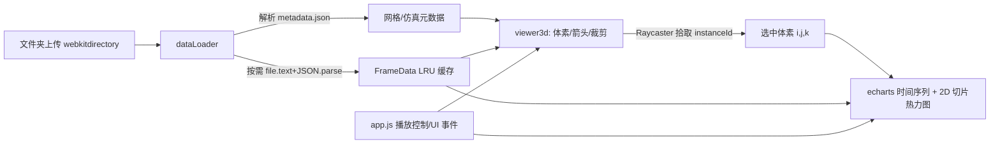

## 用户需求

为 CFD 计算流体力学引擎的模拟结果（位于 `demo/frames/`）构建一个 Web 可视化应用，代码保存在 `demo/` 文件夹中。

## 产品概述

一个亮色模式的单页 CFD 结果可视化仪表盘：用户上传 demo 文件夹后，依据 `metadata.json` 重建 48×48×48 三维体素模型，并惰性加载 + 缓存 `frame_xxx.json` 帧数据，以动画回放 CFD 模拟过程。支持多调色板着色、速度矢量箭头、体素点选时间序列、任意横截面查看，界面支持中英文切换。

## 核心功能

- **文件夹上传与体素建模**：通过文件夹选择框上传 demo，解析 `metadata.json` 构建三维体素网格（Nx×Ny×Nz，原点、间距、索引顺序 `i*ny*nz+j*nz+k`）。
- **帧数据惰性加载 + 缓存动画**：仅持有帧 `File` 引用，播放到对应帧时才读取解析，LRU 缓存约 12 帧；以播放/暂停/调速/拖拽进度方式动画回放。
- **多调色板着色**：提供 viridis/plasma/turbo/jet/coolwarm/grayscale/inferno 等调色板，按所选标量场（pressure/density/speed 等）归一化着色，支持自动/手动值域与透明阈值。
- **矢量箭头开关**：可开启/关闭每个体素（子采样后）的速度矢量箭头，由 `(u,v,w)` 决定方向与长度，按速度或当前场着色。
- **体素点选与时间序列**：鼠标点击拾取体素，高亮显示并在曲线图中展示该体素所有帧的时间序列（含进度提示）。
- **横截面查看**：通过 UI 选择轴（X/Y/Z）、位置滑块与开关，使用裁剪平面在三维视图中切出任意截面，并提供 2D 切片热力图面板（按调色板着色，逐帧更新）。
- **多语言与亮色模式**：界面为中文/英文，header 中 toggle 按钮切换并持久化；整体亮色主题。

## 技术栈选择

- **前端框架**：纯 HTML5 + 原生 JavaScript（ES Module，无构建步骤），双击 `index.html` 即可运行。
- **三维渲染**：three.js（r0.160+，CDN），使用 `InstancedMesh` 渲染体素与箭头，`OrbitControls` 交互，`material.clippingPlanes` 实现横截面。
- **图表**：echarts.js（CDN UMD）绘制时间序列曲线与色标条。
- **数据加载**：浏览器 `File` API + `webkitdirectory` 文件夹上传，无后端。
- **样式**：原生 CSS（亮色主题），无 UI 组件库。

## 实现方案

### 总体策略

采用「数据层 / 视图层 / 控制层」分离：dataLoader 负责上传、解析与缓存；viewer3d 负责 three.js 渲染（体素、箭头、裁剪、拾取）；charts 负责 echarts 与 2D 切片；app.js 串联 UI 事件与播放状态。元数据仅解析一次；帧数据按需惰性读取并 LRU 缓存，避免一次性解析 1.6GB 数据导致内存与卡顿。

### 关键技术决策

1. **体素渲染用 InstancedMesh**：11 万个体素若逐个建 Mesh 会导致 11 万次 draw call。改用单个 `BoxGeometry` + `InstancedMesh(count=N)`，逐帧仅更新 `instanceColor` 缓冲（N×3 Float32Array，约 33 万浮点，更新耗时 <5ms），性能可控。
2. **帧惰性读取 + LRU 缓存**：上传后仅保存帧文件名→`File` 的映射；播放到帧 i 时 `await file.text()` 再 `JSON.parse`（20MB 帧解析约 0.5–1.5s），解析后抽取 `pressure/density/u/v/w` 为 `Float32Array`（约 2.2MB/帧）存入 LRU（上限 12 帧 ≈ 26MB）。播放时预取下一帧以消除卡顿；解析期间显示加载指示并暂停推进。
3. **矢量箭头子采样**：11 万支箭头不现实，按步长 `stride`（默认 2，约 1.4 万支；可调到 3，约 4 千支）子采样，用合并箭头几何体 `InstancedMesh`，每实例矩阵由速度方向四元数 + 长度缩放构成，颜色随速度归一化。开关控制整体可见性。
4. **横截面用裁剪平面 + 2D 切片**：三维视图用 `renderer.localClippingEnabled=true` + `THREE.Plane`（选轴+位置滑块），实时切出截面；同时用离屏 canvas 将所选切片按当前调色板绘制为热力图（逐帧更新），二者互补。
5. **点选用 Raycaster**：命中 `InstancedMesh` 返回 `instanceId` → 反算 `(i,j,k)`；时间序列需遍历读取全部帧提取该索引标量，显示进度且仅缓存结果数组（80 个浮点），不污染 LRU。

### 性能与可靠性

- 复杂度：每帧渲染 O(N) 颜色更新；N=110,592，现代 GPU/CPU 可承受。瓶颈为 20MB JSON 解析，已用预取 + LRU + 加载提示缓解。
- 内存：LRU 上限 12 帧；时间序列读取不缓存整帧。
- 健壮性：上传后自动定位 `metadata.json`（按文件名搜索），帧路径相对 metadata 所在目录解析；对缺失字段、空目录、解析失败给出可读错误提示。

## 实现注意事项

- **复用现有数据约定**：严格遵循 `IndexOrder = i*ny*nz + j*nz + k` 与 `velocity` 为 `u,v,w` 交错数组（长度 3N）；`metadata.Frames[].File` 为相对 metadata 目录的文件名，须 `path.dirname(metaPath) + File` 解析。
- **坐标映射**：i→X、j→Y、k→Z（来自 `FluidField`，形状 `(Nx,Ny,Nz)`、U/V/W 为 x/y/z 分量）；体素世界坐标 = `Origin + index*Spacing`；裁剪平面与切片轴依此对应。
- **避免重渲染抖动**：颜色/箭头更新使用 `needsUpdate` 标志；仅在字段、调色板、阈值、帧变化时重算，避免每帧全量重算。
- **日志**：仅在加载/解析/拾取关键节点用 `console.info/warn`，不打印大数组；解析失败 `console.error` 并 UI 提示。
- **向后兼容**：不修改 `demo/frames/*` 任何文件；新增应用文件彼此独立。

## 架构设计

### 数据流



### 模块职责

- **dataLoader**：上传、定位 metadata、构建帧 `File` 映射、`getFrame(i)` 惰性读取 + LRU、抽取 `Float32Array` 字段。
- **colormaps**：多个调色板函数 `t∈[0,1]→[r,g,b]`，含离散 LUT 与采样。
- **viewer3d**：场景/相机/光照、`InstancedMesh` 体素与箭头、裁剪平面横截面、拾取与高亮、色标条。
- **charts**：echarts 时间序列、2D 切片 canvas 绘制、色标条渲染。
- **app**：状态对象（当前帧、字段、调色板、阈值、箭头、截面）、播放循环、UI 绑定、i18n 切换。

## 目录结构

```
demo/
├── index.html              # [NEW] 应用入口。引入 three.js(importmap)/echarts(CDN)、布局骨架（顶栏/左控制面板/中央视口/右信息面板/底部时间轴）、语言 toggle、three.js 容器与 echarts 容器。
├── css/
│   └── style.css           # [NEW] 亮色主题样式。顶栏、侧栏控制面板、视口、信息/图表面板、时间轴、滑块/下拉/按钮、响应式布局。
└── js/
    ├── i18n.js             # [NEW] 中/英词典与 t(key) 函数、语言 toggle、localStorage 持久化；所有 UI 文本经此渲染。
    ├── colormaps.js        # [NEW] 调色板集合（viridis/plasma/turbo/jet/coolwarm/grayscale/inferno），提供 sampleColormap(name,t)。
    ├── dataLoader.js       # [NEW] 上传处理（webkitdirectory）、定位并解析 metadata.json、构建帧 File 映射、getFrame(i) 惰性读取+JSON.parse+抽取 Float32Array、LRU 缓存（cap≈12）、预取、错误提示。
    ├── viewer3d.js         # [NEW] three.js 场景/相机/OrbitControls/光照；InstancedMesh 体素（逐帧 instanceColor 更新）、箭头 InstancedMesh（子采样+方向四元数+颜色）、clippingPlanes 横截面、Raycaster 拾取与高亮、色标条。
    ├── charts.js           # [NEW] echarts 时间序列折线图（按选中体素遍历所有帧）、2D 切片 canvas 热力图（按调色板着色，逐帧更新）、色标条 canvas 绘制。
    └── app.js              # [NEW] 全局状态、播放/暂停/调速/进度控制、UI 事件绑定（字段/调色板/阈值/箭头/截面/语言）、模块协调与整体联调。
```

## 关键代码结构

```js
// dataLoader.js —— 单帧解析结果（仅保留渲染必需的 5 个场，降低内存）
interface FrameData {
  step: number;
  time: number;
  pressure: Float32Array; // 长度 N = nx*ny*nz，索引 i*ny*nz + j*nz + k
  density:  Float32Array;
  u: Float32Array;
  v: Float32Array;
  w: Float32Array;
}

// colormaps.js —— 归一化标量 t∈[0,1] → RGB(0..255)
type ColormapFn = (t: number) => [number, number, number];
```

## 设计风格

采用「科学仪表盘（Scientific Dashboard）」亮色风格：浅灰背景 + 白色卡片面板，柔和阴影与微圆角，主色为蓝/青色系，强调数据可读性。布局为桌面端单页：顶部通栏 Header（标题 + 中/EN 语言切换 + 上传按钮），左侧控制面板（字段、调色板、值域、阈值、箭头、横截面），中央 three.js 三维视口（含色标条与坐标轴指示），右侧信息面板（选中体素数据 + echarts 时间序列 + 2D 切片热力图），底部时间轴（播放/暂停、调速、进度拖拽、步进/时间显示）。交互含悬停高亮、滑块实时反馈、面板微动效，整体专业、清晰、现代。

## 页面区块（单页，桌面端）

- **顶部 Header 栏**：应用标题（CFD 可视化）、右侧「中 / EN」语言切换 toggle、左侧「上传 demo 文件夹」按钮；浅色背景、底部细分割线。
- **左侧控制面板**：分组卡片——标量场选择（pressure/density/speed）、调色板下拉、颜色值域（自动/手动 min-max）、透明阈值滑块、矢量箭头开关 + 子采样密度滑块、横截面（轴 X/Y/Z、位置滑块、启用开关）。
- **中央三维视口**：three.js Canvas，OrbitControls 旋转/缩放/平移；体素场着色、箭头（可开关）、裁剪平面截面、选中体素高亮框；右下角色标条（colorbar）与坐标轴指示；加载时居中 spinner。
- **右侧信息面板**：选中体素的坐标与当前场值/速度；echarts 时间序列折线图（该体素跨帧曲线）；2D 切片热力图 canvas（当前横截面着色）。
- **底部时间轴栏**：播放/暂停按钮、速度（fps）选择、帧进度滑块、当前 Step/Time 文本、加载进度指示。