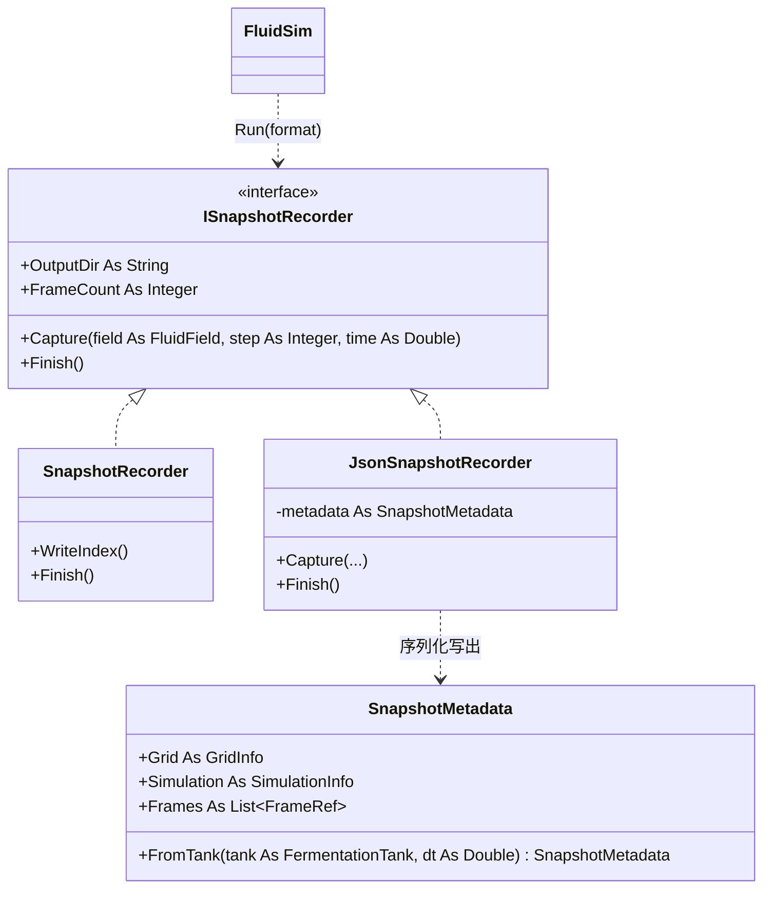

## 用户需求

在保留现有基于 VTK 文件的数据快照系统的前提下，新增一套基于 JSON 文件的数据快照系统，以消除帧与帧之间重复的“三维体素模型定义信息”带来的高冗余。新系统通过 metadata.json 保存网格/体素模型与模拟配置参数，通过 frame_xxx.json 系列文件逐帧保存物理场结果，并可通过参数在 VTK 与 JSON 两套系统间切换，且不得破坏原有 VTK 系统。

## 产品概述

重构并扩展 CFD 引擎的快照模块：原有逐帧导出 .vtk + animation.pvd 的功能保持不变；新增 metadata.json（一次性写入网格与配置）+ frame_xxx.json（逐帧写出 7 个物理场扁平数组）的导出路径，显著降低帧间存储冗余。

## 核心特性

- 保留并兼容原有 VTK 逐帧快照（.vtk + .pvd）。
- 新增 JSON 快照：metadata.json 保存三维体素网格（维度/原点/间距）与模拟配置（粘度、扩散、时间步、搅拌器几何与运动参数）。
- 每帧导出 frame_xxx.json，含 step/time 及全部 7 个物理场（pressure、density、u、v、w、speed、velocity）的扁平一维数组。
- 通过统一的 ISnapshotRecorder 接口与 SnapshotFormat 枚举参数，在 VTK / JSON 之间切换；同时保留显式传入自定义记录器的能力。
- 沿用“零内存驻留”策略：逐帧立即写盘，仅缓存轻量元数据。

## 技术栈

- 语言/框架：VB.NET，目标框架 net10.0（与现有项目一致）。
- JSON 序列化：System.Text.Json（net10 共享框架自带，无需额外 NuGet 包）。
- 复用现有模式：StreamWriter 手动写出大数组（参考 VTKExporter / SnapshotRecorder），仅依赖 FluidField，与引擎解耦。

## 实现方案

### 策略

引入统一抽象 ISnapshotRecorder 接口，使现有 SnapshotRecorder 与新 JsonSnapshotRecorder 互为可替换实现；FluidSim.Run 改以接口类型接收记录器，并新增 SnapshotFormat 枚举参数重载，内部按枚举构造对应记录器（JSON 路径自动由 Tank 派生 metadata）。这样旧调用（传入 SnapshotRecorder）完全向后兼容，新增枚举参数即可一键切换格式。

### 关键技术决策

- 接口方法取 Capture(field, step, time) 与 Finish()（Finish 对应原 WriteIndex）；SnapshotRecorder 在实现 Finish 的同时保留公开 WriteIndex，避免破坏既有调用点。
- 帧数据采用扁平一维数组，索引顺序沿用引擎 Tensor.Data 的 i*ny*nz + j*nz + k，与 VTK 导出完全对齐；velocity 以 u,v,w 交错扁平数组（长度 3N）表示，确保“全部 7 个场”。
- metadata.json 用 System.Text.Json 序列化（小文件、结构化、可读）；frame_xxx.json 因数组巨大、追求性能，沿用 StreamWriter 手工拼装 JSON 数组，避免反射与巨型字符串驻留。
- 数字精度：net10 中 Double.ToString() 默认即最短可往返（round-trip）表示，直接用于 JSON 数值，兼顾精度与体积。
- 网格/配置只在 metadata.json 写一次（构造/首帧落盘，Finish 时补写 frames 列表），帧文件不再重复网格定义——彻底消除用户所指冗余。

### 性能与可靠性

- 沿用“零内存驻留”：Capture 立即写盘，仅缓存 (time, fileName) 轻量列表；元数据文件极小，内存无压力。
- 帧文件较大（7×N 数值），写入为 O(N) 顺序 IO，与 VTK 同量级；按枚举切换不影响单帧开销。
- 对 interval 采样间隔、零填充宽度（按预计帧数估算，最小 4 位）等沿用 SnapshotRecorder 既有逻辑，行为一致。

## 实现注意事项

- 不改动 VTKExporter / Snapshot / FluidField / FermentationTank / Stirrer 的核心逻辑；SnapshotRecorder 仅追加接口实现，WriteIndex 语义不变。
- JsonSnapshotRecorder 构造时若未提供 metadata，应由 Run 通过 SnapshotMetadata.FromTank(Tank, dt) 派生（stirrer 为 Nothing 时写入 null）。
- 输出目录自动创建（同 SnapshotRecorder）。
- JSON 必须合法：数组可跨多行；数值不混入非法字符；velocity 长度为 3N。

## 架构设计



- FluidSim.Run 根据 SnapshotFormat 构造 VTK 或 JSON 记录器，统一走内部循环 + Finish()。
- 两套记录器均只依赖 FluidField / FermentationTank（metadata 派生），不互相耦合。

## 目录结构与文件

```
CFDEngine/
├── ISnapshotRecorder.vb     # [NEW] 快照记录器统一接口：OutputDir/FrameCount 只读属性、Capture、Finish。
├── SnapshotMetadata.vb      # [NEW] 元数据数据对象（可 System.Text.Json 序列化）：Grid(维度/原点/间距/索引顺序)、Simulation(粘度/扩散/时间步/求解器/搅拌器 nullable)、Frames 列表；含 FromTank 工厂方法。
├── JsonSnapshotRecorder.vb  # [NEW] 实现 ISnapshotRecorder：构造时写 metadata.json（含网格+配置），Capture 逐帧写 frame_xxx.json（7 场扁平数组），Finish 补写 frames 列表到 metadata.json。
├── SnapshotRecorder.vb      # [MODIFY] 实现 ISnapshotRecorder 接口（Finish 调 WriteIndex），保留公开 WriteIndex 兼容旧调用。
├── CFDEngine.vb             # [MODIFY] 新增 SnapshotFormat 枚举；Run 的 recorder 参数改为 ISnapshotRecorder；新增按枚举构造记录器的 Run 重载与内部循环 helper。
├── test/Program.vb          # [MODIFY] 增加可选格式参数（默认 vtk），用枚举重载 Run 演示切换；保留末帧 VTK 导出。
└── README.md                # [MODIFY] 补充 JSON 快照系统的文件结构、metadata/frame 字段说明与切换用法。
```

## 关键代码结构

```
' ISnapshotRecorder.vb
Public Interface ISnapshotRecorder
    ReadOnly Property OutputDir As String
    ReadOnly Property FrameCount As Integer
    Sub Capture(field As FluidField, stepIndex As Integer, time As Double)
    Sub Finish()
End Interface

' JsonSnapshotRecorder 帧文件 (frame_xxx.json) 结构
' {
'   "step": 0, "time": 0.0,
'   "grid": { "nx":48, "ny":48, "nz":48 },
'   "fields": {
'     "pressure":[...], "density":[...], "u":[...], "v":[...], "w":[...],
'     "speed":[...], "velocity":[u0,v0,w0,u1,v1,w1,...]   // 长度 3N 交错扁平数组
'   }
' }
```