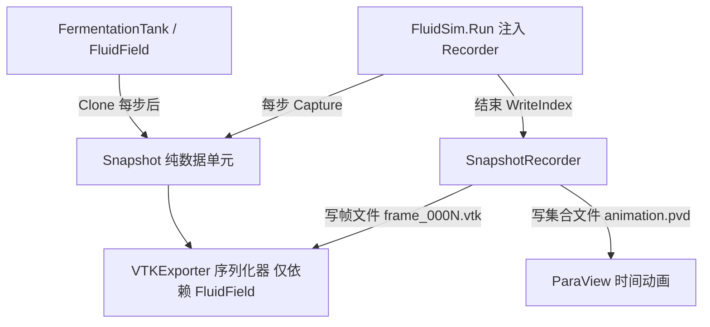

## 用户需求

重构基于 ParaView legacy VTK 格式的 CFD 数据快照系统，使其模块化并与 `FermentationTank` 对象解耦，同时支持保存 CFD 计算的每一帧数据以便用动画形式观察仿真结果。

## 产品概述

当前快照系统（VTKExporter）直接依赖 `FermentationTank` 对象读写 `Field/StepCount/Time`，且仅在模拟结束后导出最后一帧。重构后将建立独立的“快照数据模型 + 序列化器 + 记录器”三层结构：快照为纯数据单元，序列化器只面向 `FluidField`，记录器负责按帧持久化并生成 ParaView 可加载的时间动画集合文件（.pvd）。在 `FluidSim.Run` 中注入记录器即可实现逐帧捕获，无需修改求解器与搅拌器核心逻辑。

## 核心功能

- 新增与引擎解耦的快照数据模型 `Snapshot`（持有 `FluidField` 深拷贝、步号、时间）。
- 将 `VTKExporter` 重构为仅依赖 `FluidField` 的通用序列化器（保留 pressure/density/speed/velocity 字段与现有 VTK 头格式兼容）。
- 新增模块化记录器 `SnapshotRecorder`：按采样间隔把每帧写入零填充序号的 `.vtk` 文件，并在模拟结束后生成 `.pvd` 时间集合文件，供 ParaView 一键动画播放。
- 在 `FluidSim.Run` 中接入可选 `SnapshotRecorder`，每步后自动捕获、结束后自动写索引。
- 更新测试 demo，演示逐帧导出与单帧导出两种用法。

## 技术栈

- 语言：VB.NET（沿用现有项目，项目文件 `CFDEngine.vbproj`）
- 依赖：仅使用框架自带 `System.IO`，无新增第三方依赖
- 数据载体：现有 `FluidField`（含 `Clone()` 深拷贝与 `U/V/W/Pressure/Density` 五个 `Tensor` 场）

## 实现方案

### 总体策略

采用“数据模型 / 序列化器 / 记录器”职责分离，彻底消除 VTK 导出对 `FermentationTank` 的耦合。`VTKExporter` 只认 `FluidField`；新增 `Snapshot` 作为不依赖引擎的纯数据单元；新增 `SnapshotRecorder` 负责按帧落盘与生成 ParaView 的 `.pvd` 集合。通过在 `FluidSim.Run` 注入记录器，在每步回调中捕获当前 `Tank.Field` 的克隆，从而把“每一帧”都保存下来。

### 关键决策与权衡

- **解耦而非继承**：`VTKExporter.Export` 改为接受 `FluidField` 并新增 `Export(snapshot As Snapshot)` 重载，旧 `Export(tank As FermentationTank)` 签名移除（调用方同步更新），避免长期保留强耦合 API。
- **零内存驻留**：`SnapshotRecorder.Capture` 直接把克隆场写入文件并丢弃，只把 `(step, time, fileName)` 元数据缓存在内存，避免 N 帧全量驻留导致内存爆炸（N×Nx×Ny×Nz×5 个 double）。
- **`.pvd` 动画集合**：ParaView 原生支持 `.pvd`（Collection + DataSet timestep），一次加载即得时间轴动画，比逐文件手动导入体验更好。
- **文件名零填充宽度**：依据预计总帧数 `ceil(steps/interval)` 估算宽度（至少 4 位），保证 ParaView 文件排序正确。
- **复用现有模式**：`FluidSim.Run` 已有 `progressCallback As Action(Of Integer, Double)`，记录器复用同一“每步后”时机，不改动 `FermentationTank.StepForward` 与求解器。

### 性能与可靠性

- 每帧导出为 O(Nx·Ny·Nz) 的 ASCII 顺序写，热点仅是三重循环 + `StreamWriter`，与现有单帧导出同复杂度；逐帧场景 I/O 总量为 N 倍，属预期代价。
- 输出目录用 `Directory.CreateDirectory` 自动创建，避免目录不存在异常。
- 仅持久化克隆（`FluidField.Clone()`），不持有引擎内部张量引用，杜绝回写污染。

## 实现注意事项

- 保持 legacy VTK 头格式不变（`# vtk DataFile Version 3.0` / `ASCII` / `DATASET STRUCTURED_POINTS` / `DIMENSIONS` / `ORIGIN 0 0 0` / `SPACING 1 1 1` / `POINT_DATA` / `SCALARS pressure/density/speed` / `VECTORS velocity`），确保已生成的 ParaView 工作流继续兼容。
- `.pvd` 中 `timestep` 使用 `Snapshot.Time`，`file` 用相对路径，便于整体拷贝到其它机器。
- 兼容旧的 `ExportSliceCSV`：改为接受 `FluidField` 参数，保持切片 CSV 导出能力。
- 测试 demo 同步更新：移除对已删除 `Export(tank,...)` 的调用，改用 `Export(field,...)` 及 `SnapshotRecorder`。

## 架构设计



## 目录结构

```
g:/Moira/src/CFDEngine/
├── Snapshot.vb              # [NEW] 快照数据模型。定义 Snapshot 类，持有 Field As FluidField(深拷贝)、Step As Integer、Time As Double；提供构造函数接收 (field, step, time) 并内部 Clone，确保与引擎解耦、不可变快照。
├── VTKExporter.vb          # [MODIFY] 重构为解耦序列化器。Export(field As FluidField, filePath, Optional step, Optional time) 为主入口；新增 Export(snapshot As Snapshot, filePath) 重载；ExportSliceCSV(field As FluidField, k, filePath) 改为面向 FluidField；移除对 FermentationTank 的所有引用。
├── SnapshotRecorder.vb     # [NEW] 模块化记录器。构造参数(outputDir, baseName, Optional interval=1, Optional pvdName="animation.pvd")；Capture(field, step, time) 写零填充帧文件并缓存元数据；WriteIndex() 生成 .pvd 集合；全靠 FluidField，与 Tank 解耦。
├── CFDEngine.vb            # [MODIFY] FluidSim.Run 增加 Optional recorder As SnapshotRecorder = Nothing；每步后若非 Nothing 则 recorder.Capture(Tank.Field, Tank.StepCount, Tank.Time)；循环结束后若非 Nothing 则 recorder.WriteIndex()。
└── test/
    └── Program.vb          # [MODIFY] 演示逐帧导出：创建 SnapshotRecorder，传入 Run；生成 .pvd；保留一次单帧 VTKExporter.Export(Tank.Field,...) 作对照；同步调用解耦后新 API。
```

## 关键代码结构（参考）

```
' Snapshot.vb —— 纯数据快照单元（不依赖引擎/罐）
Public Class Snapshot
    Public ReadOnly Property Step As Integer
    Public ReadOnly Property Time As Double
    Public ReadOnly Property Field As FluidField   ' 深拷贝，独立生命周期
    Public Sub New(field As FluidField, step As Integer, time As Double)
        Me.Field = field.Clone()
        Me.Step = step
        Me.Time = time
    End Sub
End Class

' SnapshotRecorder.vb —— 模块化逐帧记录器
Public Class SnapshotRecorder
    Public Sub New(outputDir As String, baseName As String,
                   Optional interval As Integer = 1,
                   Optional pvdName As String = "animation.pvd")
    Public Sub Capture(field As FluidField, step As Integer, time As Double)
    Public Sub WriteIndex()
End Class
```