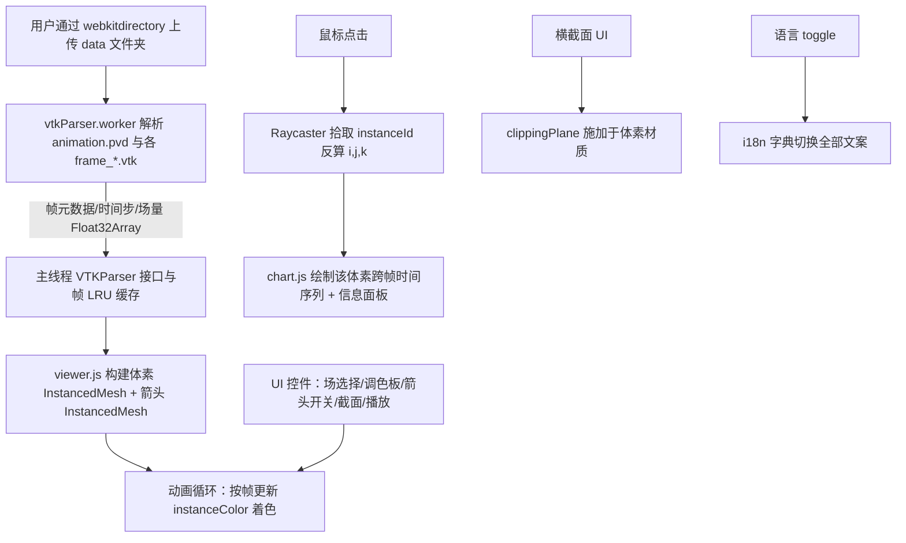

## 产品概述

基于 HTML + JavaScript + three.js 的本地 Web 应用，用于可视化用户 CFD 流体力学引擎导出的模拟结果（ParaView Legacy VTK 格式）。用户上传包含 `animation.pvd` 与若干 `frame_xxx.vtk` 的 data 文件夹后，程序解析数据并在浏览器中构建三维体素模型、播放 CFD 动画、进行多调色板颜色渲染、矢量箭头展示、网格点选时间序列曲线以及任意横截面查看。界面为亮色模式，支持中英文一键切换。

## 核心功能

- **文件夹上传与解析**：通过 `webkitdirectory` 选择 data 文件夹，解析 `.pvd`（动画帧与时间步）与 `.vtk`（48×48×48 结构化点网格，含 pressure/density/u/v/w/speed/velocity 七类场量），解析过程在 Web Worker 中执行并显示进度条。
- **三维体素模型构建**：以 InstancedMesh 渲染全部 110592 个体素盒，按所选物理场 + 调色板着色，顶点位置映射为 (i,j,k)*spacing。
- **CFD 动画播放**：根据 PVD 时间步序列逐帧（或按播放速度/滑块）更新体素颜色，支持播放/暂停/调速/帧定位。
- **多种颜色调色板**：内置 Viridis、Plasma、Inferno、Turbo、Jet、Cool-Warm、Grayscale 等调色板，附颜色图例与归一化范围调节。
- **示踪剂矢量箭头开关**：以子采样（每隔若干体素）的 InstancedMesh 箭头展示速度方向/大小，可一键开启或关闭。
- **网格点选与时间序列曲线**：鼠标点击拾取体素 (i,j,k)，高亮该网格，并用折线图展示该网格在所有帧中某场量的时间序列（横轴为 PVD 时间步）。
- **横截面查看**：提供 X/Y/Z 轴截面 + 位置滑块，以及“任意平面”（法向量 + 距离）模式，通过 three.js 局部裁剪平面揭示内部可视化结果。
- **多语言与亮色 UI**：右上角中/英切换按钮，所有文案经 i18n 字典切换；整体亮色、专业科学仪表盘风格。

## 技术栈选择

- 前端：纯 HTML + JavaScript（ES Module）+ CSS，无构建步骤，本地双击/静态托管即可运行。
- 3D 渲染：three.js（经 CDN importmap 引入，含 OrbitControls、InstancedMesh、Raycaster、clippingPlanes）。
- 图表：Chart.js（经 CDN importmap 引入）绘制时间序列折线图。
- 并行解析：Web Worker（`vtkParser.worker.js`）承担大体积文本解析，主线程保持响应。

## 实现方案

- **整体策略**：上传目录 → Worker 解析 PVD 帧表与各 VTK 场量到 Float32Array → 主线程构建 three.js 体素/箭头 InstancedMesh → 动画循环按帧更新 instanceColor → 交互（拾取/裁剪/调色板/语言）驱动视图更新。
- **关键决策**：

1. *解析下沉到 Worker*：单帧约 100 万数值、80 帧纯文本约数百 MB，主线程解析会卡死；Worker + 分词 + 进度回调，解析完通过 Transferable ArrayBuffer 回传，零拷贝。
2. *内存与帧缓存（LRU）*：不一次性常驻全部 80 帧解码结果，仅缓存最近若干帧（如 5 帧）用于流畅播放；选中体素做时间序列时，按需解码该体素所在的所有帧并缓存其时间序列数组，兼顾内存与体验（48³×80×9×4B 全量约 300MB，LRU 方案可降至约数十 MB）。
3. *体素用 InstancedMesh*：单次 draw call 渲染 11 万盒，instanceColor 逐帧更新；仅在“帧/场/调色板/范围”变化时重算颜色，避免冗余。
4. *箭头子采样 + 复用几何体*：将圆柱+锥合并为单一箭头几何体用 InstancedMesh 渲染，按速度方向构造实例矩阵，抽取间隔（如步长 2~3，约 1.4 万根）以控制开销。
5. *横截面用 clippingPlanes*：开启 `renderer.localClippingEnabled`，对体素材质施加裁剪平面，配合轴/位置/任意法向的 UI 控制，无需重建几何即可“切开”查看内部。

- **性能与可靠性**：体素拾取用 Raycaster 命中 InstancedMesh 的 instanceId 反算 (i,j,k)（idx=i+j*nx+k*nx*ny）；颜色映射预计算调色板 LUT（256 级）避免逐像素插值；动画用 `requestAnimationFrame` 并按时间步插值定位帧；解析失败/缺字段给出明确错误提示。内存峰值受 LRU 与 Float32 控制，桌面浏览器可稳定运行。

## 实现要点（落地注意事项）

- **索引对齐**：严格按导出器写入顺序 `For k→For j→For i` 解析，线性索引 `idx = i + j*nx + k*nx*ny`；three.js 中体素实例位置 `(i+0.5, j+0.5, k+0.5)*SPACING`（居中于格），保持与 VTK 原点/间距一致。
- **字段与归一化**：自动计算各场 min/max，提供手动范围覆盖；speed 可由 u/v/w 推导，但 VTK 已含 speed，优先读取。
- **日志/进度**：解析进度（已处理帧数/体素块）回传主线程进度条；避免打印大块数据，错误只记录字段名与帧号。
- **向后兼容**：仅读取已确认的七类场；缺失某场时禁用对应选项并提示，不中断整体加载。

## 架构设计



## 目录结构

```
g:/Moira/test/test2/
├── index.html              # [NEW] 页面骨架：顶部栏（标题/上传/语言切换）、左侧控制面板、中央 3D 视口、底部图表与信息面板；含 importmap（three.js、Chart.js）与模块脚本入口。
├── css/
│   └── styles.css          # [NEW] 亮色模式样式：布局（flex/grid）、控件、进度条、图例、响应式；科学仪表盘风格配色变量。
└── js/
    ├── i18n.js             # [NEW] 中英文文案字典与切换逻辑：data-i18n 标记替换、动态文案更新、当前语言持久化。
    ├── palettes.js         # [NEW] 调色板实现：Viridis/Plasma/Inferno/Turbo/Jet/CoolWarm/Grayscale 的 t∈[0,1]→RGB 映射 + 256 级 LUT + 颜色图例渲染。
    ├── vtkParser.worker.js # [NEW] Web Worker：高效分词解析 .pvd（帧文件列表+timestep）与 .vtk（STRUCTURED_POINTS 七类场），按块回传进度，最终 Transferable 回传 TypedArray。
    ├── vtkParser.js        # [NEW] 主线程与 Worker 的接口：提交 File 列表、接收解析结果、帧 LRU 缓存、按 (frame,field) 取数据、按需解码体素时间序列。
    ├── viewer.js           # [NEW] three.js 场景：相机/光照/OrbitControls；体素 InstancedMesh 与箭头 InstancedMesh；raycaster 拾取；clippingPlane 横截面；动画播放循环；调色板/场/范围更新。
    ├── chart.js            # [NEW] 时间序列折线图：基于 Chart.js 绘制选中体素跨帧某场量曲线（x 轴为 PVD 时间步），含坐标轴/图例/多场叠加与数值提示。
    └── app.js              # [NEW] 整体编排：文件上传（webkitdirectory）、全局状态、UI 事件绑定（场/调色板/箭头/截面/播放/语言）、模块协同。
```

## 关键代码结构

```javascript
// 调色板接口：归一化值 t∈[0,1] → [r,g,b]（0~255）
export type PaletteFn = (t: number) => [number, number, number];
export interface Palette { name: string; map: PaletteFn; buildLUT(steps: number): Uint8Array; }

// 解析结果核心结构
export interface VTKDataset {
  nx: number; ny: number; nz: number;
  origin: [number, number, number];
  spacing: [number, number, number];
  timesteps: number[];          // 来自 .pvd，长度=帧数
  frameFiles: string[];         // frame_xxxx.vtk 文件名
  fields: string[];             // ["pressure","density","u","v","w","speed","velocity"]
  getFrame(field: string, frame: number): Float32Array; // 经 LRU 解码
}
```

## 设计风格

采用**亮色科学可视化仪表盘（Light Scientific Dashboard）**风格：以浅灰背景衬托白色面板与卡片，主色为沉稳科技蓝，辅以细微阴影、圆角与分隔线，营造专业、清晰、低噪的数据分析氛围。整体布局为顶部栏 + 左侧控制面板 + 中央三维视口 + 底部图表/信息栏，区块分明、信息密度合理。

## 页面区块（自上而下 / 自左而右）

- **顶部栏**：左侧应用标题与数据状态徽标；右侧含「上传数据文件夹」按钮与「中 / EN」语言切换 Toggle（亮色胶囊按钮）。
- **左侧控制面板**：分组卡片——① 显示场选择（下拉）② 调色板选择 + 颜色图例条 + 归一化范围双滑块 ③ 矢量箭头开关 ④ 横截面控制（轴 X/Y/Z 单选 + 位置滑块 + 任意平面法向输入）⑤ 动画播放控制（播放/暂停、速度、帧滑块、当前时间步显示）。
- **中央三维视口**：three.js 画布，OrbitControls 旋转/缩放；体素网格着色显示；箭头叠加；选中体素高亮线框；裁剪平面切开效果；轻量坐标轴与网格地面。
- **底部图表/信息栏**：左侧选中体素 (i,j,k) 与各场量实时数值卡片；右侧 Chart.js 时间序列折线图（可切换显示场、叠加多条曲线）。

## 交互与动效

- 控件 hover 微高亮、滑块顺滑、面板卡片轻阴影；语言切换瞬时刷新全部文案；上传/解析显示进度条与百分比；播放时视口无明显卡顿（LRU 帧缓存）。
- 响应式：窗口缩放时画布与图表自适应；窄屏下左侧面板可折叠为抽屉。

## Agent Extensions

### Skill

- **agent-browser**
- Purpose: 在浏览器中加载并自动化验证 Web 应用（打开页面、上传 data 文件夹、检查三维渲染、动画、点选、截面、调色板与语言切换）。
- Expected outcome: 确认应用可正常加载、数据解析无错、核心交互功能均可用，并截图留证。